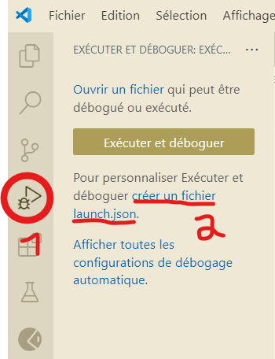
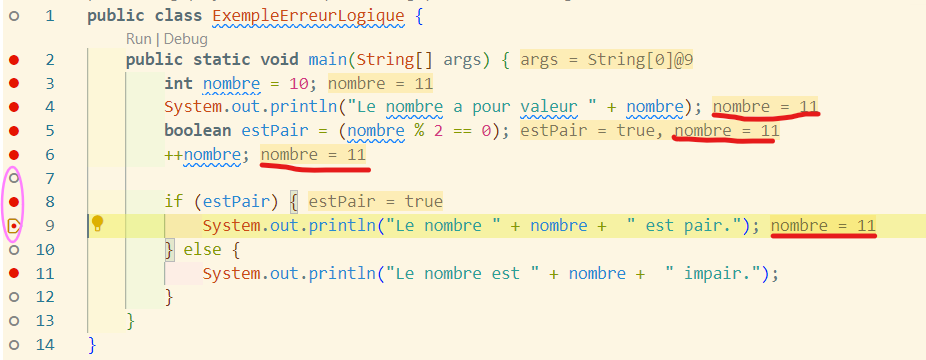

# Debuger le code Java sur VSCode

Je décide de faire un tuto annexe sur le débogage en Java depuis VSCode pour trois raisons très simples : 

- J'ai eu beaucoup de mal à le configurer et à le comprendre.
- Si j'ai rencontré ces difficultés, je pars du principe que je ne suis pas seul dans ce cas, et que quelques explications supplémentaires ne sont pas de trop.
- L'absence de ressources en français, actuelles, sur le débogage Java sur VSCode. Si d'un côté j'ai tout à fait conscience que la maîtrise de l'anglais technique est un indispensable du développement et que tôt ou tard il faut se résoudre à plonger dans ce grand bain; je me dis de l'autre côté que donner les ressources de base en français peut peut-être encourager un peu plus de monde à se lancer dans Java, et au moins donner quelques clés qui pourront ensuite être exploitées pour parfaire ses connaissances grâce à des ressources en anglais.

Mais avant d'attaquer les instructions de configuration à proprement parler, essayons de voir en quoi consiste le débogage, à quoi il sert, et à voir s'il intervient plutôt sur la **compilation** du code Java en Bytecode ou sur **l'exécution** par la Java Virtual Machine.

## 1. Rappel de la vision Java : "Code once, run everywhere"

Commençons par un rappel élémentaire, Java est un langage **complié**, c'est à dire qu'avant d'être exécuté, il est "traduit" dans un langage intermédiaire, le *Bytecode* (beaucoup plus proche du langage binaire que Java), qui  via la *Java Virtual Machine*, est exécuté par l'ordinateur. L'idée derrière cette exécution en deux temps est qu'une fois le code écrit et compilé, on peut l'exécuter sur tous les environements possibles, sans devoir le retoucher, l'exécution produisant toujours l'effet attendu.

C'est en se basant sur cette différence centrale entre ces deux étapes qu'on peut aborder la question des erreurs qu'on peut rencontrer dans son code, en faisant la distinction entre les erreurs **syntaxiques**, qui prennent place avant la compilation du code et les erreurs **logiques** qui elles arrivent à l'exécution, alors que le code en lui-même est bien écrit.

## 2. Les erreurs syntaxiques

Ce rappel fait, parlons maintenant des types d'erreurs que l'on peut faire quand on code en général : il y a d'une part les erreurs **syntaxiques** et de l'autre, les **erreurs logiques**. Les premières sont celles qui empêchent le code d'être compilé en Bytecode.  

Les erreurs **syntaxiques** qui apparaissent quand on a un code qui comporte des fautes d'orthographe dans le nom d'une variable, qu'on oublie une accolade dans le code, qu'on attribue un mauvais type de valeur à une variable donnée, qu'on oublie un `;` pour fermer une instruction, que dans une expression utilisant l'opérateur relationnel d'équivalence et qu'on écrit `=` au lieu de `==`, ... bref, toutes erreurs de non-respect des conventions Java. Et quand on tente de faire tourner un code qui comprend de telles erreurs, la compilation échoue, la console de Git Bash ou celle incluse dans VSCode vous le signifiant, et indiquant même les lignes où il y a un problème. L'idée ici est que le compilateur n'arrive pas à faire son travail si le code n'est pas correctement écrit.

Par exemple, si vous lancez ce code :

```Java
public class SyntaxErrors {
    public static void main(String[] args {
        int number = 10
        System.out.println("Le nombre est : " + number);
        if (number = 10) {
            System.out.println("Le nombre est égal à 10");
        }
    }
}
```

Voilà ce que vous aurez dans la *console*, qui est l'endroit qui indique nos erreurs de **syntaxe** :


Avec ici l'indication de deux erreurs, qui correspondent à ce que vous dit VSCode :


Les commentaires Git Bash vous indiquent bien que, ligne 2, il manque une `)` pour clôturer la méthode "main" et à la ligne 3, un `;` pour clôturer l'instruction.

Et ces erreurs corrigées, Git Bash vous indiquera celle ligne 5.

Une fois les erreurs corrigées, vous verrez que ``SyntaxError.class`` est dans le dossier, c'est-à-dire que le compilateur a pu fonctionner car il n'y avait plus d'erreurs de *syntaxe* :


Et là, votre code s'exécutera sans encombre.

## 3. Les erreurs logiques

C'est ici que les choses vont se complexifier quelque peu. Jusqu'à présent, les erreurs que nous faisons ne portaient pas forcément à conséquence, vu qu'elles empéchaient le code d'être compilé.

Cependant, il arrive souvent que l'on ait un code bien écrit sans faute grossière, qui se compile et qui s'exécute et... produit des erreurs. Qui peuvent avoir des conséquences si le code n'est pas bien débogué. Et parfois, ces erreurs peuvent avoir des conséquences assez lourdes, comme décollage d'Ariane 5 en 1996 qui a mené à une désintégration de la fusée suite à une erreur de conversion de données, ou bien plus récemment, avec la mise à jour d'un logiciel de la firme CrowdStrike le 19 juillet 2024, où un bug passé inaperçu, a mené à une paralyse de nombreux services publics et privés pendant de longues heures.

Dans ces cas, le code s'exécute correctement, il n'y a pas d'erreurs de *syntaxe*. En revanche, dans la gestion des variables, il y a des manipulations de valeurs qui donnent des résultats inattendus et potentiellement problématiques. Si vous suivez le tutoriel Java que j'ai écrit ou suis en train d'écrire, vous imaginez bien que, par exemple, un mauvais encodage ou traitement d'une variable booléenne en début de script dans le cas d'une structure conditionnelle qui arrête tout en début d'exécution peut mener à de grosses déconvenues. C'est ce que nous appelons les erreurs **logiques**, qui elles, ne sont pas détectées lors de la compilation et qui peuvent être bien plus pénibles à débusquer.

Voici un code syntaxiquement juste, mais qui contient une erreur logique :

```java
public class ExempleErreurLogique {
    public static void main(String[] args) {
        int nombre = 10;
        System.out.println("Le nombre a pour valeur " + nombre);
        boolean estPair = (nombre % 2 == 0);
        nombre++;

        if (estPair) {
            System.out.println("Le nombre " + nombre +  " est pair.");
        } else {
            System.out.println("Le nombre est " + nombre +  " impair.");
        }
    }
}
```

Si vous avez parcouru le tuto principal jusqu'aux différents types d'opérateurs, vous verrez bien, avec un peu de logique, que le modulo d'un nombre, le reste de la division euclidienne, doit être égal à zéro si le nombre divisé est pair. Or ici, on a mis comme condition que `estPair` est vrai si le modulo de `nombre` par deux est égal à zéro. Ensuite, on incrémente `nombre`, ce qui change sa valeur.

Et pourtant, quand on exécute le code, il tourne sans soucis, car il n'y a aucune erreur syntaxique :


Mais d'un point de vue *logique*, ça ne va pas, car la variable `nombre` change subitement de valeur !

C'est là qu'un outil de débogage peut être très utile, car il permet de voir au fur et à mesure que s'exécute le code la valeur que prend une variable donnée.

Et c'est là qu'on doit remettre les mains dans le cambouis pour configurer VSCode pour que le débogueur fonctionne !

## 4. Configurer le débogueur Java pour VSCode

### 4.1. Vérification des installations

Si vous avez suivi la première partie du tuto sur Java à laquelle ce tuto de débogage sert de complément, vous avez en principe installé toutes les extensions de VSCode nécessaires pour déboguer du code Java.

En principe, en installant Java et en le paramétrant pour pourvoir y accéder via VSCode, vous avez déjà installé tout le nécessaire, à savoir **Debugger for Java**. Pour s'assurer que vous l'ayez correctement installé, cliquez dans la barre verticale de gauche sur le logo avec les carrés, puis dans l'espace de recherche en haut, entrez "debugger for Java", et la première extension qui apparaîtra sera en principe la bonne. Cliquez enfin dessus si vous voulez être absolument certain qu'elle est installée.


En cliquant sur les différents éléments dans l'ordre indiqué sur l'image ci-dessus, vous verrez bien vite si oui, ou non, vous avez le'extension pour le débogage.

### 4.2. Configuration du débogueur

L'étape suivante va consister à configurer le débogueur. Pour cela, vous devez cliquer dans la barre verticale de gauche sur le symbole de triangle avec un petit insecte et puis sur "exécuter et déboguer" ou la ligne "créer un fichier launch.json", comme indiqué sur l'image ci-dessous, si vous voulez peaufiner les règles de débogage :



Avant de créer ce fichier, un petit mot sur la nécessité d'un tel fichier : si vous avez suivi la première partie du tuto général consacré à Java, je vous ai longuement parlé des différentes versions de Java disponibles, et vous ai même montré comment en installer plusieurs. Si vous vous souvenez aussi, je vous ai parlé de "JDK" pour `Java Development Kit`, qui est grosso l'ensemble des outils nécessaires pour faire tourner une version de Java, de l'écriture jusqu'à l'exécution en passant par la compilation.

Or, pour déboguer correctement un code en Java, votre débogueur doit tenir compte de ce genre de paramètres !

De plus, il existe plusieurs façons différentes de déboguer : choisir le bon point d'entrée (comprendre : à partir d'où on commence le débogage), et d'autres paramètres. En l'état, je propose de travailler directement en cliquant sur `Exécuter et déboguer`, et de ne pas s'occuper personnellement de la configuration de `launch.json`.

### 4.3. Autres manières de lancer le débogueur

Le bouton `Exécuter et déboguer` n'est pas la seule manière de lancer un débogage, voyez plutôt :


- La première option consiste à cliquer sur le bouton `Exécuter et déboguer`.
- La seconde, à cliquer sur le petit chevron pointant vers le bas à gauche du triangle en haut à droite de l'interface.
- La quatrième, en cliquant directement après la déclaration de classe sur "Debug".
- La troisième, non visible sur l'interface, consiste à simplement appuyer sur "F5".

### 4.4. Le débogage : les breakpoints

Comme nous le savons déjà, le débogage que nous utilisons actuellement est celui qui s'intéresse aux **erreurs logiques**, aux mauvaises attributions de valeur aux mauvaises variables, et il s'agit alors de les débusquer petit à petit, comme le chasseur en embuscade derrière son buisson attendant que le gibier passe.

Et la différence entre le débogage et la chasse, c'est que, quand on débogue, on installe nous-même nos buissons, qu'on appelle **breakpoints** ! Il s'agit d'une série de points rouge que l'on place dans notre code, à des lignes spécifiques.

Ils servent à voir la valeur qu'à une variable *à la ligne juste au-dessus*. Oui, vous avez bien lu, les breakpoints sont toujours placés une ligne en dessous que la variable qu'on veut vérifier ! La raison à cela est simple : quand un programme est exécuté, il l'est ligne par ligne, instruction après instruction. Et pour qu'une instruction soit exécutée, il faut toujours que le programme ait "parcouru" toute la ligne, et que face au symbole `;`, il sache qu'il doit exécuter l'instruction et passer à la ligne suivante.

Cependant, il y a quelques exceptions à ajouter :

- Si vous êtes à `ligne +1` mais que c'est une ligne vide ou un commentaire, ajoutez votre commentaire à la prochaine instruction rencontrée.
- Si vous voulez vérifier la valeur d'une variable à la dernière ligne d'un code, mettez le breakpoint à cette ligne, et non plus à `ligne +1`.
- Si votre code se termine sur un `If... else`, soit une instruction conditionnelle, les seuls breakpoints pris en compte seront ceux placés aux sous-blocs d'exécution exécutés car la condition spécifique est vérifiée.
- Si vous placez un breakpoint à une ligne non pertinente (que ce soit dû à un commentaire, une ligne vide ou une condition non répétée), il n'apparaitra pas comme un point rouge dans votre code, mais comme un fin cercle noir, lors de l'exécution du débogage.
-   
Regardez dans l'image ci-dessous, j'ai entouré la marge où placer les breakpoints, et ai mis un breakpoint (à l'aide d'un clic gauche, un autre clic gauche supprime le breakpoint) à chaque ligne du code :


Reste à exécuter le débogage et à voir comment interpréter les valeurs.

### 4.5. Le débogage : exécution du débogage et console de débogage : les deux approches

Une fois que vous avez lancé le débogage, voilà ce que vous voyez :


Sur l'image j'ai mis en évidence trois grandes zones :

1) Ce que j'appelle la "colonne d'exécution du débogage" dans laquelle on trouve :
   - Les variables et leurs valeurs au fur et à mesure qu'elles apparaissent,
   - La section "espion" qui permet de suivre certaines particulières (il suffit pour cela de survoler la zone, d'appuyer sur le "+" qui apparait et d'ajouter la valeur qui vous intéresse, par exemple "nombre"),
   - La pile d'appel qui montre où on en est dans la liste des breakpoints analysables,
   - Les points d'arrêts, qui reprend toute la liste des breakpoints, y compris les non pertinents, qui sont alors grisés.

2) La console de débogage, qui permet d'avoir un suivi de la valeur de variables précises aux lignes pertinentes

3) L'interface de débogage qui à l'image d'une télécommande de télévision et ses différents boutons, de gauche à droite :
   - **continuer**, qui passe les instructions les unes après les autres,
   - **pas à pas principal**, un synonyme de "continuer" qui ausculte le code ligne par ligne de la première à la dernière, à partir du premier breakpoint rencontré sans tenir compte des suivants,
   - **Pas à pas détaillé** qui va rentrer dans les fonctions et méthodes spécifiques que vous écrirez une fois que vous connaîtrez ce point théorique pour les décortiquer dans le détail (essayez donc sur la première ligne de votre code qui déclare la classe, juste pour voir...),
   - **Pas  à pas sortant**, qui vous sort de la dissection des classes et méthodes,
   - **Redémarrer** qui va reprendre le débogage du début,
   - **Arrêter** qui va mettre fin au débogage,
   - **Hot code replace** qui permet de modifier le code à la volée quand on a identifié une erreur t qu'on veut la corriger directement, sans devoir arrêter le débogage, faire la correction, recompiler, etc.

Si vous utilisez la fonction "continuer", vous verrez que le débogueur s'arrêtera à chaque ligne pertinente, vu que vous avez mis des breakpoints partout. Arrivé à la ligne 8, dernière à être activement déboguée, la partie de la colonne d'exécution consacrée aux variables indiquera toutes les variables rencontrées dans votre code et la valeur qu'elle a à la fin de l'exécution. 

Si dans Espion vous ajoutez la variable `nombre`, vous verrez la valeur qu'elle aura spécifiquement à la fin de l'exécution du code, sans tenir compte des autres.


Et si vous regardez ben cette image, vous verrez aussi que, au fur et à mesure que le code s'exécute, vous verrez les valeurs des variables s'afficher dans ce dernier...


... jusqu'à ce qu'une ligne de code qui change la valeur d'une variable modifie effectivement cette dernière !



Ici, le cercle violet montre qu'on a exécuté les lignes après le changement de valeur de `nombre` et que la valeur de `nombre` a changé pou toutes ses occurrences, peu importe où il apparaît dans le code, vu que le débogage est une opération synchronique, qui se fait "en live", et non diachronique, c'est-à-dire "une étape après l'autre".

La **Console de débogage**, quant à elle reste un outil classique. A une ligne donnée, en entrant le nom d'une variable de voir sa valeur en live, et même de la modifier. SI par exemple, la première fois que vous rencontrerez `nombre`, si vous tapez "nombre" dans la console de débogage, on vous indiquera sa valeur, soit 10.


Ce que vous pouvez faire à ce moment, c'est de rentrer une valeur autre valeur, mettons "11" :


Et continuez le débogage jusqu'à la fin. Si vous observez bien, l'output final donnera 12 comme valeur pour `nombre` et "false" pour `estPair` :


Vous l'aurez compris, la console de débogage sert grosso modo à travailler de manière synchronique sur le code lors du débogage en réassignant les valeurs des variables de manière immédiate, mais sans modifier le code en lui-même, ce qui vous permet de tester les modifications possibles et les effets qu'elles entraineraient, sans pour autant devoir faire de recompilations fastidieuses.

Ce n'est pas l'outil le plus puissant, mais avec les informations données par la *colonne d'exécution de débogage* et en la couplant aux  différentes *commandes de débogage*, vous saurez déjà faire pas mal de choses en débogage !

## 5. Conclusion

Nous voilà arrivés au bout de ce tutoriel sur le débogage. Pour être honnête, il y a encore beaucoup de choses qui pourraient être explorées, et expliquées, permettant une compréhension encore plus fine et de Java, et du débogage. Mais en l'état, je préfère en rester qu'à ce qui est strictement nécessaire pour faire les tâches de débogage les plus fréquentes.

Si d'aventure je réalise que d'autres commandes de débogage doivent être connues pour aller plus loin, je développerai ce tutoriel avec ces nouvelles données. Mais en l'état, vous disposez déjà que d'assez de connaissances pour régler au bas mot 80-905% des erreurs logiques que vous rencontrerez !