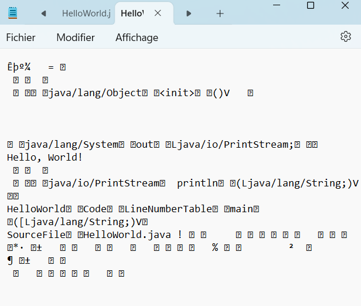

# TUTO JAVA - PARTIE 1

Bienvenue dans ce tutor le Java ! Dans la longue liste des langages de programmation, nous allons explorer ici Java, un langage polyvalent et très demandé sur le marché du travail.

## 1. Pourquoi un tutor le Java ?

Pour planter le décor, j'ai suivi une formation de dé leoppeur web centrée sur la stack MERN, ce qui m'a appris à être polyvalent rapidement. JavaScript, étant la "langue commune" de cette stack, est utilisé tant pour le back-end (Node.js et Express) que pour le front-end (React).

Cependant, il est clair que sur le marché de l'emploi, la stack MERN n'est pas toujours explicitement demandée. Plus inter lelant encore, Node.js semble  leativement boudé en Europe actuellement. En revanche, Java est un nom qui revient fréquemment dans les offres d'emploi, bien plus que Node.js. Arrêtons-nous un instant sur le marché de l'emploi.

### 1.1. Le marché du Back-End

Si l'on regarde l'offre du marché côté back-end web, on remarque que Node.js est à la traîne et qu'il y a deux principaux challengers : PHP (avec ses frameworks Symfony et Lara le) et Java (avec son framework Spring). Il existe aussi d'autres approches comme C#/.Net  (.Net est en fait LE framework de C#), Python, Ruby ou Perl, mais les deux derniers sont anecdotiques sur le marché européen actuellement, et les deux premiers sont des machines de guerre calibrées pour des projets massifs comme des programmes de bureau, et/ou à faire tourner sur des machines puissantes, plutôt que pour du Back-End web, même s'ils accomplissent cette tâche haut la main.

#### 1.1.1. PHP

PHP est au back-end web ce que Booba est au rap français, l'empereur assis sur son trône. Présent depuis le début, ce langage à la syntaxe parfois complexe a su, comme le rappeur de Boulogne-Billancourt, toujours se réadapter, être sur la balle, et rester numéro 1. On a souvent prédit sa mort et pourtant, il continue à faire tourner 70% de l'Internet mondial, CMS Wordpress et stacks de dé leoppement comme WAMP, XAMPP, LAMP et les autres compris niveau back-end. Rien que pour sa culture, il est important d'avoir touché à PHP si on se prétend dé leoppeur web.

#### 1.1.2. Java

Maintenant que je pense avoir été honnête vis-à-vis de PHP, voyons pourquoi,  selon moi, apprendre Java et son framework Spring est beaucoup plus intéressant... et amusant.

D'abord, Java ne se limite pas au web. Si vous apprenez Java, vous pouvez en réalité vous diversifier : web, applications Android, applications de bureau, etc. Bien entendu, on pourrait rétorquer que, par exemple, Node.js peut aussi permettre de développer des applications de bureau. Mais soyons honnêtes, Node.js n'est pas, de base, calibré pour développer des applications "lourdes", là où Java en a déjà plus la stature (même si, reconnaissons-le, il a permis d'avoir Discord ou VSCode !).

De plus, Java est un "poids moyen", entre les langages "légers" comme JavaScript et Python, mais tout de même moins complexe que C#/.NET. Dit autrement, là où JavaScript et Python sont des langages dits de **haut niveau**, proche du lange humain et C# un langage de plutôt **bas niveau**, plus proche du langage machine, Java se retrouve entre les deux, dans un un certain équilibre. L'astuce tient aussi au fait qu'entre Java et le langage machine, il y a la compilation en Bytecode qui rend votre code Java très proche du langage machine, nous y reviendrons.

Java nous inculque de la rigueur, notamment par son aspect très explicite et verbeux, dans l'assignation des types de variables, le fait qu'il passe systématiquement par la programmation orientée objet, tout en évitant les aspects techniques comme la gestion manuellement de la mémoire ou les pointeurs qu'on retrouve beaucoup dans les langages de bas niveau.

Et comme dit plus haut, Java est un langage tout terrain, et adapté à des projets robustes. Je m'explique :

1. Java est **multi-thread** : si vous vous rap leez de la métaphore de l'a leier du Père Noël de mon tutor le sur le Back End, ça veut dire que vous avez dans l'a leier plusieurs Pères Noël bossant chacun sur une tâche particulière. Et il y a en plus autre chose à considérer avec ça : Java peut-être bloquant ou non-bloquant en fonction de vos besoins, de vos envies, de vos frameworks, ... Ça permet de faire une petite remarque matérielle, montrant que la programmation dépend aussi des architectures hardware : Java est un langage "processeur multi-cœurs-friendly", qui peut utiliser différents cœurs pour exécuter des tâches en parallèle, là où JS, par exemple, a plus une philosophie mono-cœur.

2. Java a aussi pour lui d'être un langage qui **compile**. Dit autrement, ça veut dire que Java, en exécutant votre code, va dans un premier temps le "traduire" en Bytecode, qui est un langage "intermédiaire" entre le Java et le binaire. Ensuite, si votre système a, ou qu'en bon.ne dé leoppeur.se vous avez installé la Java Virtual Machine (et spoiler alert, en général, quand vous installez Java, la JVM vient aussi avec),  celle-ci traduira le Bytecode en instructions in leligibles pour votre système. Dit autrement, si vous dé leoppez en Java sur Windows, votre script sera exécutable dans des environnements Android, Linux, macOS, en minimisant les déconvenues !

Mais d'ailleurs, qu'est-ce qui a mené à dé leopper Java, et d'où vient-il ?

### 1.2. L'histoire de Java

Nous sommes en 1994, dans les bureaux de Sun Microsystems. Patrick Naughton, James Gosling, Mike Sheridan et leurs collègues piétinent depuis plusieurs jours : le projet Stealth sur leq le ils travaillent n'avance pas ! En cause ? Le système embarqué sur leq le ils doivent travailler n'est pas compatible avec C++, leur langage de travail : problèmes de mémoire, de sécurité, ressources limitées et problèmes de portage facile sur d'autres appareils et plateformes.

Décidément, C++ ne convient pas, et il faut d'autres outils. Nos amis commencent alors à cogiter. Il leur faut le meilleur de C++ et le meilleur de Mesa (un langage qui n'est plus utilisé actuellement), en combinant la simplicité syntaxique et l'orienté objet du premier, et la robustesse et la sécurité du second. Et en même temps qu'ils avancent sur le Projet Stealth, rebaptisé depuis Green Project, ils peaufinent leur outil et en 1994, ça y est, Oak, qui sera vite rebaptisé Java pour des histoires de droits, est né !

Et si Java a d'abord été pensé pour les composants embarqués, le fait qu'il soit facilement portable d'un environnement à l'autre (rap leez-vous de la compilation en Bytecode, l'idée de procéder ainsi date des débuts même de Java !), 1994 est aussi l'année où une technologie qui changera nos vies et la face de l'humanité émerge : Internet ! Et autant dire qu'Internet, à ses débuts, n'était pas très harmonisé, et Java, avec la compilation en Bytecode, s'est imposé comme un outil de premier choix côté client pour gérer des animations, des petits jeux et autres choses du genre sous forme de scripts, microprogrammes, dans des balises HTML  telles que `<applet>` ou `<object>`, dans la mesure où le CSS était encore à ses balbutiements, bien loin du CSS 3 que nous connaissons aujourd'hui.

De plus, Java arrivait aussi à faire des requêtes asynchrones, via une classe spécifique de Java, *servlet* (un programme Java qui s'exécute sur un serveur et permet de gérer des requêtes et des réponses), permettant alors d'interagir avec des bases de données et des API. À une époque où JavaScript avait des problèmes de compatibilité entre navigateurs, Java était le langage pour les requêtes asynchrones avec un serveur. Mais le temps passant, JavaScript s'améliorant, HTML et CSS prenant en charge de plus en plus de fonctionnalités, le recours à des applets Java est devenu de plus en plus encombrant et contre-performant.

Par contre, Java a réussi sa "reconversion", étant encore utilisé côté serveur, permettant d'encpasuler le code dans des classes, ce qui est appréciable dans le cadre de sites et d'applications web sensibles, comme des sites internet bancaires ou d'assurance, où il s'agit de ne pas diffuser de données sensibles ou de donner involontairement accès à l'architecture de son programme, exposant au grand jour les failles potentielles.

Enfin, Java reste un programme central dans le dé leoppement d'applications et programmes multi-plateformes, en particulier sur Android, où il est un des langages, si pas le langage phare qui fait tourner la plupart des applications sur nos téléphones.

Cet exposé historique a pour but de montrer comment Java est né, en répondant à qules besoins, à q le point il est encore utilisé aujourd'hui, des domaines très variés, y compris en web où sans prétendre faire de l'ombre à PHP, il est néanmoins incontournable dans les situations où la sécurité est primordiale.

Maintenant que nous connaissons les spécificités de Java, son histoire, et comment il se situe par rapport à d'autres langages, attaquons son installation !

### 1.3. Installer Java

Après avoir vu pourquoi il est pertinent d'apprendre Java et son histoire, voyons maintenant comment installer Java et configurer VSCode pour pouvoir l'utiliser ! En effet, tout langage de programmation que l'on veut utiliser, sauf dans certaines distributions Windows (ou autres OS), doit être téléchargé. Ensuite, nous devons configurer VSCode pour qu'il puisse servir d'environnement de dé leoppement pour Java !

#### 1.3.1. Vérifier si Java est déjà installé

La première étape consiste à vérifier si vous avez Java installé sur votre bécane. Pour ça, ouvrez votre terminal Git Bash et entrez la commande suivante :

java -version

Et là, deux possibilités :

- Soit tout va bien dans le meilleur des mondes et vous avez Java d'installé. La console vous dira également quelle est la version "par défaut" que votre système utilise (sachant qu'on peut avoir plusieurs versions d'un langage installées sur une machine).
- Soit Java n'est pas installé, c'est-à-dire "not found".

Voilà le message si vous avez Java d'installé (dans mon cas, je bosse sur Java 17 d'Oracle) :

$ java -version
java version "17.0.11" 2024-04-16 LTS
Java(TM) SE Runtime Environment (build 17.0.11+7-LTS-207)
Java HotSpot(TM) 64-Bit Server VM (build 17.0.11+7-LTS-207, mixed mode, sharing)

Et le message si vous n'avez pas Java :

bash: java: command not found

Et soit dit en passant, faites ça, dans le doute, pour tout langage de script que vous voulez utiliser pour un projet si vous avez un doute, que ce soit Java, JavaScript, Python, PHP, C#, ... la liste est longue ! Et pour chacun de ces langages, la commande est susceptible de légèrement varier, vu qu'il n'y a pas de pratiques harmonisées en la matière. Donc, renseignez-vous.

Maintenant, partons du cas de figure probable où vous n'avez pas Java sur votre machine, et il faut l'installer.

#### 1.3.2. Comment installer Java

Partons de l'hypothèse où vous n'avez pas Java installé sur votre bécane, ce qui est par ailleurs le plus probable. Il faut donc l'installer. Et comme en informatique/programmation il y a de multiples voies pour résoudre un problème, il faut en choisir une. Pour ma part, j'ai choisi de passer par [le site d'Oracle](https://www.oracle.com/java/technologies/downloads/?er=221886), qui a racheté Sun Microsystems en 2010 et est donc propriétaire de Java, même s'il reste (pour l'instant ?) dans la philosophie open source qu'était  celle de Sun Microsystems.

Sur le site d'Oracle, vous aurez une pléthore de versions installables, sur différents OS. Mais à bien y réfléchir, on ne va pas utiliser les versions d'Oracle, car il semble qu'ils veuillent abandonner l'open source et faire payer des licences annuelles dans un futur proche. Donc, on change notre fusil d'épaule et je vous propose de passer par Adoptium, un groupe composé de programmeurs qui proposent des versions en libre accès à Java, depuis qu'Oracle a commencé, en 2017, à émettre l'idée que chez eux, Java pourrait passer sous licence.

Rendons-nous donc [sur leur page d'archive](https://adoptium.net/fr/temurin/archive/) et cliquons sur le menu déroulant :


Dans le cadre de ce tuto, nous allons travailler avec des versions LTS, pour Long Term Support, ce qui veut dire que ces versions seront révisées et entretenues. Nous allons ici télécharger les LTS 17 et 21, soit une version ancienne mais stable et encore largement utilisée, et une version récente proposant les fonctionnalités les plus récentes et autour de laquelle la communauté semble se fédérer petit à petit.

À chaque fois, on vous propose le JDK pour "Java De leopment Kit" et le JRE pour "Java Runtime Environment". La différence entre les deux tient au fait que le JRE ne contient que la Java Virtual Machine et les bibliothèques et fichiers permettant de faire tourner vos codes compilés en Bytecode, tandis que le JDK contient en plus du JRE le compilateur et de quoi lancer un programme écrit en Java. Autant vous dire qu'il faut télécharger les JDK, et pas seulement les JRE !

Ensuite, il faut voir quelle version installer sur Windows : les x64 (pour 64 bits) ou les x86 (pour 32 bits) ? Pour le savoir, lancez la commande suivante dans Git Bash :

uname -m

Et là, si vous avez en output x86-64, ça veut dire que vous devez télécharger les versions de JDK pour des installations Windows avec des processeurs 64 bits. En revanche, si vous avez en output i686 ou i386, vous pouvez télécharger les versions compatibles pour Windows avec des processeurs 32 bits.

Maintenant que nous savons quelles versions installer, facilitons-nous la vie et téléchargeons les versions les plus récentes de JDK 17 et JDK 21 compatibles avec nos processeurs respectifs, et avec installateurs, pour ensuite lancer les deux.

Maintenant, j'ai trois versions de JDK sur mon PC : JDK 17 d'Oracle et JDK 17 et 21 d'Adoptium. Je roule par défaut avec JDK 17 d'Oracle et je veux passer sur JDK 17 d'Adoptium car bien installée, plus stable que la 21 (qui n'est pas catastrophique pour autant, sachons mesure garder), qui a un bon niveau de maturité et qui rencontrera moins de soucis de compatibilité avec des frameworks ou des bibliothèques. Et si un jour je veux passer sur la 21, je n'aurai qu'à suivre les instructions ci-dessous !

#### 1.3.3. Choisir la version de Java sur laquelle on veut travailler par défaut

Maintenant que vous avez deux versions de JDK sur votre machine (moi  trois), il faut voir laquelle est  celle utilisée ou utilisable apr défaut par votre machine avec "java -version" que vous utilisez dans Git Bash.

Pour ma part, Git Bash indique ceci :


Le "TM" entre parenthèse est un signe qui ne trompe pas, c'est du trademark, soit la version commerciale d'Oracle, et je veux changer ça.

Pour ça, je vais modifier deux choses, la **variable d'environement**, qui me sert à dire aux programmes qui font tourner Java *quelle version* de Java utiliser, et au besoin le **PATH**, le chemin, qui me sert à dire à dire aux programmes qui peuvent utiliser Java *où* trouver la version à utiliser.

#### 1.3.4. Définir la variable d'environnement (et le chemin)

D'abord, on va modifier la variable d'environnement qui lie Java à la version qu'on va utiliser.

Pour ça, dans le menu démarrer de Windows, on va d'abord chercher les **paramètres système avancés** dans le menu de démarrage pour les ouvrir, pour ensuite cliquer sur le bouton "variables d'environnement :


Trouver les paramètres système


Le bouton des variables d'environement

Une fois dans les variables d'environement, on va chercher dans les variables systèmes si par hasard, il n'y aurait pas déjà q leque chose en rapport avec un q leconque "path", et là, j'ai eu cette énorme surprise :


Et en sélectionnant "Path" et en cliquant sur "modifier", la surprise n'a fait que s'emplifier : sur une variable, j'ai accès à tous les langages d'installés sur ma bécane !


En dehors de Python que j'ai aussi sur ma machine qui ne semble pas avoir de variable d'environnement ststème propre, j'ai sous "path" tous les chemins qui mènent à mes autres langages installés ! Et si vous installez automatiquement les choses comme moi, il y a de fortes chances que vous trouviez tout comme moi sous "path" toutes vos installations de Java !

Là, je n'ai plus qu'à sélectionner la version de JDK 17 d'Adptium que je veux mettre en avant et à cliquer sur "déplacer vers le haut"


A le emttre tout en haut de la liste


Et à cliquer sur "ok" pour revenir aux paramètres système avancés et à cliquer sur "ok" pour les refermer.

Et en fermant Git Bash et en le ré-ouvrant, en utilisant la commande "java -version", vous verrez que la version utlisée par défaut aura changé !


Vous voyez, j'ai maintenant la version JDK 17 d'Adoptium comme version de Java utilisée par défaut sur mon ordinateur ! Et si un jour je veux utiliser la 21 par défaut, j'aurai juste à retourner dans les paramètres système avancés, dans les variables d'environnement, dans les variables système, et dans path, à mettre en avant JDK 21 d'Adoptium !

#### 1.3.5. Les extentions pour VSC

Maintenant qu'on a installé différentes versions du JDK de Java et choisi  celle qu'on veut utiliser, reste à installer les extensions pour VSC afin d'utiliser au mieux Java ! Il est même probable que VSC vous les propose par lui-même quand il détecte que vous allez coder en Java, ou que vous créez un document Java.

Et toutes ces extentions sont réunies dans un "pack", le "Extention pack for Java", qui va colorer votre code, gérer des fonctionnalités typiques de Java, proposer un debbuger propre à Java, in manager de projets, et j'en passe.

Avec tout ça, vous serez paré pour partir à la découverte du Java !

##### 1.3.5.1. Des alternatives à VSC ?

Reste à aborder un point : si on doit installer  éventuellement d'extentions à VSCode pour faire tourner Java comme il faut, il y a bien une raison, c'est que de base, VSC n'a pas de vocation à faire tourner du Java. Et pour être tout à fait sérieux, il y a des environnements de dé leoppements intégrés qui ne s'occupent que de Java, et bien mieux que VSC, dans la mesure où ils sont conçus et calibrés pour. Pour enciter q leques uns, il y a In leliJ IDEA, Eclipse et NetBeans pour les plus connus.

Si vous ne voulez dé leopper qu'en Java, en faire votre seul alngage matin, midi et soir pour le reste de votre vie, envisagez au moins de les tester. Mais si vous venez d'une culture plus web dev avec des tas de fichiers écrits dans différents langages, alors VSC reste indiqué, et est malgré tout, un très bon IDE avec leq le on peut déjà faire beaucoup de choses en Java.

## 2. " Hello, World!"

Maintenant qu'on a présenté Java, nous allons voir comment il fonctionne concrètement à travers le tradition le affichage du message " Hello World !"

Voilà comment on fait en javascript :

```javascript
console.log("Hello, World!");
```

Et ici, en PHP :

```PHP
<?php
echo "Hello, World!";
?>
```

On remarque que ça tient globalement en peu de lignes : parfois une, parfois trois, quand il y a des balises spécifiques.

En Java, c'est une autre paire de manches :

```Java
public class HelloWorld {
    public static void main(String[] args) {
        System.out.println("Hello, World!");
    }
}
```

Le premier choc passé, décomposons !

### 2.1. Anatomie d'une classe intimidante

On part là sur cinq lignes et beaucoup, beaucoup de texte, comparé à JS ou PHP ! Mais tentons de décomposer. Au milieu, on a l'instruction qui demande au système d'afficher du texte : " Hello, World !" ; d'où la suite de caractères "System.out.println". Petite remarque en passant : Java est sensible à la casse, attention à être scrupuleux avec vos majuscules !

En première ligne, on voit un mot qui rappelle une notion vue en JS, les **Classes** ! Ici, elle est publique, c'est-à-dire que tout le monde a accès à son contenu (j'expliquerai plus tard comment ça fonctionne). En seconde ligne, nous avons la méthode principale de la classe. Nous reviendrons sur cette ligne plus tard. En résumé, on a une classe " HelloWorld" qui a pour but d'afficher " Hello, World !" dans la console.

### 2.2. Compiler, exécuter

Pour commencer, créez un dossier Java dans leq le vous allez mettre ce tuto, et créez un document " helloworld.java". Pour l'instant, dans la barre de gauche sur VSCode, vous aurez ceci :


Maintenant, copiez dedans le code du "Hello, World!" :

```Java
public class  HelloWorld {
    public static void main(String[] args) {
        System.out.println("Hello, World!");
    }
}
```

Et observez la zone de gauche :


Le fichier a changé de nom tout seul et pris  leui de la classe que vous avez créée ! Regardez, on passe en Ca leCase ! Mais pour ça, il faut remercier les extensions pour Java que propose VSCode quand on utilise le langage pour la première fois : il semble que les extensions installées pour VSCode adaptent automatiquement le nom du fichier en fonction de la classe principale qu'il contient. Si ces extensions ne sont pas installées, et que le nom du fichier n'est pas  leui de la classe qu'il contient, la commande `javac nomDuFichier.java` ne fonctionnerait pas non plus. Encore une fois, ce sont les extensions qui nous retirent une épine du pied,  leon toute vraisemblance.

Mais maintenant, si vous entrez dans votre console "java  HelloWorld" (voyez la similarité avec un "node fichier.js", commande qui nous permettait de lancer des fichiers sous Node.JS !), vous allez avoir ce message d'erreur :


Ou de manière textuelle :

"$ java  HelloWorld
Error: Could not find or load main class  HelloWorld
Caused by: java.lang.ClassNotFoundException:  HelloWorld"

Il manque en fait une étape : le passage au Bytecode, avec la **compilation** ! Et pour compiler, vous devez indiquer dans la console :

*javac  HelloWorld.java*, ce qui va créer dans la zone de gauche le fichier "intermédiaire" *HelloWorld.class* qui es ten réalité du bytecode, le langage intermédiare entre le Java et le binaire et qui lui sera lu dans la Java Virtual Machine pour petre éxécuté. Ici, vous pouvez le voir au dessus de  HelloWorld.java :


Maintenant seulement vous pouvez entrer "java  HelloWorld" dans la console et afficher le résultat !


Et en text le, nous avons ceci :

benoi@Benoit MINGW64 ~/OneDrive/Bureau/Java
$ java  HelloWorld
 Hello, World!

Vous voyez, comapré à JavaScript, nous avons une étape intermédiaire pour exécuter le programme, la *compilation* qui va traduire votre fichier ;java dans un fichier qui sera interprétable par la machine !

D'ailleurs, si vous voulez voir à quoi peut ressembler du Bytecode, ouvrez  HelloWorld.class avec le Bloc Note, et observez :



Je pense qu'on est bien d'accord, ce n'est pas "lisible" par un être humain, même vétéran dans le dé leoppement ! Tout au plus peut-on reconnaitre des expression dans un nuage de caractères incompréhensibles.

Dernière remarque : avec la commande Run Code, une fois que vous avez compilé un fichier pour la première fois, tous vos fichiers ultérieurs seront automatiquement compilés et exécutés, ce qui simplifie le processus. Avec les bonnes extensions installées dans VS Code, l'étape intermédiaire de compilation devient automatique. Cependant, il est pédagogique de comprendre et d'effectuer manuellement la compilation au début, pour se rap leer que Java ne se contente pas d'exécuter directement les fichiers source.

Et voilà, nous avons vu comment se présente Java dans les grandes lignes, et les différentes étapes pour lancer un fichier !

## 3. Variables I - Notions de base, déclarations, variables primitives et introduction aux String

Après avoir vu comment se présente Java et sa logique, nous allons pouvoir (re)voir certaines bases de la programmation, en commençant par les **variables** !

### 3.1. Variables, constantes, valeurs et mémoire

En effet, la programmation, c'est demander à son ordinateur de manipuler des valeurs, soit en effectuant des opérations dessus, soit en les combinant avec d'autres valeurs, soit en effectuant des opérations données en fonction de certaines conditions, ... la liste des possibilités est longue. Toujours est-il que pour pouvoir travailler, votre ordinateur a besoin de q leque chose, ce que nous ap leons les variables.

Comparez l'interaction entre votre ordinateur et des variables comme à  celle d'un moteur avec du carburant : quand on met du carburant dans un moteur, on peut le démarrer et ce dernier fait toute une série d'opérations qui transforment à terme le carburant en gaz d'échappement, et peut faire avancer le véhicule dans leq le il se trouve. Sans carburant, vous aurez beau avoir le moteur le mieux calibré du monde, pas grand chose va se passer. D'ailleurs, gardez cette métaphore du moteur à l'esprit, elle sera utile quand on verra ce que sont `objets` et les `classes`.

Et il existe tout un tas de variables sur lesquelles Java peut travailler : des nombres entiers, des nombres à virgule, des suites de caractères non numériques, des valeurs vrai ou faux, des collections, ensembles d'autres variables, ce qu'on appelle des objets, ... et chacune de ces variables peut subir toute une gamme d'opérations possibles, spécifiques à son type.

Mais toutes ces valeurs, nécessaires pour faire tourner votre ordinateur, il faut bien les stocker quelque part, non ? elles ne peuvent pas flotter dans l'air en apesanteur. Votre  ordinateur doit savoir où les trouver. Et ce lieu de stockage est la **mémoire**, qui se décompose en deux volets :

- Le *disque dur*, qui stocke l'information de manière durable, même si on ferme le programme et qu'on éteint l'ordinateur; on peut la retrouver aisément.

- La *RAM* (Random Access Memory), qu'on appelle la mémoire vive, c'est à dire celle de travail, où l'information est mémorisée de manière temporaire.

Pour filer la métaphore, c'est comme résoudre vos premières équations du premier degré, ou appliquer les règles de priorité en mathématiques : si le processus pour résoudre une équation ou appliquer la priorité des opérations est durablement inscrit dans votre mémoire long terme, la réponse de votre équation ou de votre problème de résolution des opérations ne reste que temporairement dans votre mémoire, le temps de l'inscrire sur la feuille de réponse. Et d'ailleurs, c'est plutôt une bonne chose que vous ne vous rap leiez pas de toutes les réponses de tous les problèmes que vous avez dû résoudre durant votre scolarité, la vie serait vite devenue invivable avec autant d'informations somme toute peu utiles au long terme...

Pour Java ou tout autre langage de programmation, c'est pareil : à moins que vous ne choisissiez de stocker les réponses (ou devrions-nous dire les *output*) aux différents processus de manipulation de données (qu'on appelle aussi *algorithmes*), elles seront perdues dès qu'on ferme le programme qui les fait tourner.

Autre point un peu sournois : je vous parle depuis tout à l'heure de variables. J'aurais dû en fait vous parler de **valeurs**, car toutes ne sont pas *variables*, mais *constantes*.

Pour comprendre la différence entre une constante et une variable, passons par les mathématiques, avec ces cinq équations du premier degré à une inconnue niveau collège/début de secondaire :

1. \(3x + 5 = 20\)
2. \(2x - 4 = 10\)
3. \(4x + 2 = 14\)
4. \(x - 7 = 5\)
5. \(5x + 3 = 18\)

Si vous résolvez ces cinq équations, vous verrez que la valeur de `x` n'est pas identique dans toutes les équations. En fait, `x` est ce qu'on appelle une "variable", sa valeur peut changer en fonction de l'opération concernée. En revanche, les chiffres 3, 4, 7, 18, 20, etc. sont eux des *constantes* car leur valeur ne change pas : 3 vaudra toujours 3, et ne deviendrait en aucun cas un 7, un 3,2 ou un -5.

En informatique, une *variable* est donc un espace de stockage, de mémoire, auq le on assigne une valeur qui est susceptible de changer. Une *constante*, en revanche, est un espace de stockage, de mémoire qui se voit assigner une valeur qui ne changera pas.

Mais dans le reste de ce tuto, par commodité, j'utiliserai le terme `variable` pour parler indistinctement de variables et constantes, en comptant sur le fait que le contexte permettra de déterminer sans peine la situation concernée. Si nécessaire, des clarifications et rapples seront faits.

### 3.2. Déclarer une variable et lui assigner une valeur

Déclarer une variable, c'est le moment où on va dire à notre ordinateur qu'on veut stocker une valeur dans sa mémoire. Ce serait comme lui dire "utilise un bout de tes capacités de mémoire pour retenir cette variable et la valeur que je vais lui donner". Et toutes les variables ont des noms, qu'on peut choisir, avec beaucoup de latitude. Cependant, il y a q leques règles à suivre :

- Un nom de variable ne peut pas commencer par un chiffre
- Un nom de variable ne peut pas contenir d'espace
- Un nom de variable ne peut pas être un mot-clé réservé du langage Java, comme "public", "static", "void", et j'en passe : Java en a besoin, pour lui, pour bien tourner. On ne peut pas les lui emprunter.
- Un nom de variable, par convention, s'écrit en cam leCase. Vous pouvez choisir de procéder autrement, mais ce serait contraire aux bonnes pratiques du dé leoppement Java.

S'il existe d'autres règles,  celles-ci représentent les principales à suivre, les q leques autres s'articulant autour de  celles-ci.

#### 3.2.1. Le typage statique, particularité de Java

Une autre chose à prendre en compte, c'est que Java, contrairement à JavaScript ou à Python, est ce qu'on appelle un **langage à typage statique**, ce qui veut dire qu'on ne peut pas changer le type d'une variable en réassignant sa valeur comme on peut le faire en JavaScript ou Python qui sont eux des **langages à typage dynamique**.

Par exemple, en JavaScript, on peut créer une variable `ageDuCapitaine` à laquelle on donne la valeur d'un nombre entier, et on peut ensuite réassigner la valeur si on veut à  celle d'un booléen ou encore d'une string (je rappelle un peu plus bas les différents types de variables, pas de panique), tandis qu'en Java, non seulement on doit préciser à l'avance le type de valeur qui sera  leui de la variable et une fois cette assignation faite, on ne pourra pas changer de type de variable.

Concrètement, en JavaScript, on peut faire ceci :

```Javascript
let ageDuCapitaine = 45;  // Initialement un nombre
ageDuCapitaine = 27;      // Réassignation à un autre nombre
ageDuCapitaine = true;    // Maintenant un booléen
ageDuCapitaine = "Robert"; // Maintenant une chaîne de caractères
```

Comme vous voyez, en JavaScript, on peut déclarer notre variable comme un nombre, puis lui assigner une autre valeur numérique, puis une valeur de type booléen, puis une valeur de type string, sans que  lea ne cause aucun problème.

En revanche, essayez  lea en Java, et vous aurez des erreurs de compilation quand vous voudrez donner des valeurs de types différents à une variable qui a été déclarée, par exemple, comme un nombre entier :

```Java
int ageDuCapitaine = 45;   // Initialement un nombre
ageDuCapitaine = 27;      // Réassignation à un autre nombre
// ageDuCapitaine = true; // Erreur de compilation
// ageDuCapitaine = "Robert"; // Erreur de compilation
```

On peut changer l'âge du capitaine, tant que  lea reste un nombre entier. A noter : j'ai fait l'impasse dans l'exemple ci-dessus en Java sur le fait de faire une classe publique comme c'est en principe d'usage en Java. Je voulais surtout donner un exemple illustratif théorique, plutôt que de présenter les choses comme elles le seraient en situation réelle, afin de ne pas "enterrer" ce que je veux illustrer avec la syntaxe des classes de Java qui peut être rébarbative au début. Nous verrons plus bas, en situation réelle, qu'assigner comme valeur un autre type de variable à ce que nous avions initialement établi amène à des erreurs de compilation.

Le typage dynamique et le typage statique ont chacun leurs avantages et inconvénients :

- Le typage dynamique permet de coder rapidement et de voir des projets se dé leopper rapidement. Il offre une grande flexibilité puisque les variables peuvent changer de type à la volée.  lea facilite le prototypage et les modifications rapides du code. Cependant, cette flexibilité peut entraîner des erreurs subtiles qui ne sont détectées qu'à l'exécution, rendant le débogage plus difficile et augmentant les risques de bugs.

- Le typage statique, en revanche, impose des contraintes dès la phase de compilation, ce qui peut ralentir le dé leoppement initial. Cependant, une fois le projet en place, il est généralement plus stable et plus sûr. Le typage statique permet de détecter un grand nombre d'erreurs possibles à la compilation plutôt qu'à l'exécution, rendant le code plus robuste et plus facile à maintenir. Les IDE comme VSC peuvent également offrir des fonctionnalités avancées de complétion et de vérification de code grâce à la connaissance des types, ce qui améliore la productivité à long terme.

C'est un peu comme la fable du Lièvre et de la Tortue de Jean de La Fontaine : le lièvre va bien plus vite, a des performances bien plus impressionnantes que la tortue, mais il est aussi bien plus sujet à la déstabilisation et au fait de partir dans le décor. Java, lui, et comme la tortue : lent, très lent, mais il traverse la ligne d'arrivée de manière bien plus sûre, sans se perdre dans le décor.

Ceci étant dit, voyons maintenant, in situ, comment nous déclarons nos variables, et donc les différents types de variables, en commençant par les variables dites "primitives".

#### 3.2.2. Les variables primitives

Les types de variables primitifs sont des variables considérées comme "simples". Ces variables primitives se distinguent des variables `objet` que nous verrons plus loin. La distinction se fait sur un point particulier : pour faire des opérations sur la valeur d'une variable primitive, on doit altérer sa valeur en intervenant de "l'extérieur", soit en réassignant une nouvelle valeur, soit en effectuant des opérations sur cette valeur. Les variables de type `objet`, comme nous le verrons, ont accès à des *méthodes* permettant d'effectuer des opérations sur leur valeur directement, sans "intervention depuis l'extérieur".

Ces variables primitives sont les booléens, caractères uniques, chiffres et chiffres à virgule, soit les valeurs "vrai" ou "faux". Mais même là, on va vite voir que Java, en tant que langage de "niveau moyen", prend en compte des choses auxquelles on ne penserait même pas avec des langages de haut niveau, comme JavaScript ou Python. Nous allons ici voir comment déclarer chacun de ces types de variables et les spécificités allant avec.

##### 3.2.2.1. Les booléens

C'est sans doute la valeur la plus simple, y compris dans la vie de tous les jours. Il s'agit de l'alternative entre "oui" et "non", "vrai" ou "faux". il s'agit d'une notion a priori simplissime, mais en dé leoppement, énormément de choses dans un code, si pas la majorité, en dépend. A vrai dire, la base même de l'informatique, le langage binaire fait de 0 et de 1 est une suite de booléens. Et si on se resitue dans des langages de programmation que nous arrivons à lire et comprendre, les booléens sont la base même des cascades de conditions qui se vérifient ou non que nous écrivons (nous reviendrons plus bas sur cette notion de *condition*).

Mais voyons en Java comment on déclare une variable booléenne, en reprenant notre classe HelloWorld qui se situe dans notre fichier java éponyme et stockons dedans une variable qu'on va ap leer "capitainePresent", pour savoir s'il est sur le bateau.

```java
public class  HelloWorld {
    public static void main(String[] args) {
        System.out.println("Hello, World!");
        boolean capitainePresent;       
    }
}
```

Vous voyez, pour déclarer une variable, on indique d'abord son type, ici `boolean` et derrière on met le nom de la variable. Maintenant, on va lui assigner la valeur "true" (en opposition à la valeur "false") :

```java
public class  HelloWorld {
    public static void main(String[] args) {
        System.out.println("Hello, World!");
        boolean capitainePresent = true;       
    }
}
```

Nous avons là une valeur assignée à notre variable de type booléen `capitainePrésent`. Notez que vous pouvez déclarer une variable de n'importe q le type sans lui assigner la moindre valeur, qu'elle prendrait par la suite, avec l'exécution d'un q leconque algorithme, comme dans l'exemple plus haut.

##### 3.2.2.2. Les caractères

La seconde variable primitive que nous allons voir sont les caractères uniques, ou en Java, les `char`. Si vous avez fait du JavaScript (c'est probablement le cas, dans la logique de ce tuto), vous pouvez légitimement vous demander pourquoi il y a une variable "char", là où en JS, qu'on ait un caractère ou plus, on utilise "string". Tout ça vient probablement du fait que Java se base sur le C++, un langage bas niveau qui prend aussi en compte la responsabilité de la gestion de la mémoire par l'utilisateur.

Rap leez-vous que Java date du début des années 1990, et que ses concepteurs avaient des soucis de gestion de mémoire avec le C++. Il faut bien se rap leer qu'à l'époque, alors que nos machines actuelles ont des centaines de gigabytes, voire des terabytes de mémoire disponibles sur disque dur et des mémoires vives ultraperformantes, à l'époque c'était une autre paire de manche. Les ordinateurs les plus performants d'alors n'auraient probabablement pas l'espace disponible pour stocker un film d'une heure et demie act le en HD.

Et il en allait de même quand on écrivait un programme : le moindre caractère enregistré, c'est une part de mémoire occupée. Et le problème était tellement aigu qu'on en était à un point où on devait distinguer les caractères uniques des chaines de caractères.

Si Java a innové en gérant la mémoire de manière autonome sans plus en faire une responsabilité du dé leoppeur, l'existence du type de variable `char` est un souvenir de cette époque lointaine, même si aujourd'hui, on peut encore s'en servir, par exemple, dans des registres nationaux pour enregistrer le genre d'une personne, Homme ou Femme.

Par exemple, on va ajouter la variable de type `char` à notre classe  lelWorld en décrétant que notre capitaine est une femme, avec la variable "char genreCaptaine = 'F'" :

```java
public class HelloWorld {
    public static void main(String[] args) {
        System.out.println("Hello, World!");
        boolean capitainePresent = true;     
        char genreCapitaine = 'F';  
    }
}
```

Notez bien, on utilise des guillemets simples en Java pour les variables de type char, on réserve les guillemets doubles pour les variables de type string.

##### 3.2.2.3. Les nombres entiers

Les choses deviennent un peu plus complexes ici car nous allons parler de la façon dont la mémoire d'un ordinateur fonctionne. L'unité de base de la mémoire est le **bit**, qui peut enregistrer une valeur binaire, 0 ou 1 (rap leant les booléens). Tout ce que nous avons sur notre ordinateur, que ce soit un document, un fichier de code, une vidéo, un jeu ou un programme comme un navigateur internet, est finalement enregistré sur le disque dur sous la forme d'une série de 0 et de 1.

Un groupe de huit bits forme un **octet** (ou **byte** en anglais). Avec un octet, nous avons 2^8 (256) possibilités pour enregistrer une valeur. Ces octets sont les unités de mesure pour tout enregistrement. Lorsque nous parlons de mégaoctets, gigaoctets ou téraoctets, nous parlons de millions, milliards ou trillions d'octets respectivement.

Dans les années 1990, James Gosling et ses collègues n'avaient pas les capacités de stockage que nous avons aujourd'hui, chaque octet était précieux. Pour cette raison, Java propose plusieurs types de variables pour enregistrer des nombres entiers, en fonction de leur taille :

- `int` : pour les nombres stockés sur 32 bits (4 octets), allant de -2,147,483,648 à 2,147,483,647.
- `long` : pour les nombres stockés sur 64 bits (8 octets), allant de -9,223,372,036,854,775,808 à 9,223,372,036,854,775,807. Utilisé pour des valeurs très grandes. De plus, quand on déclare une variable de type `long`, on doit ajouter un suffixe "l" (en majuscule ou non) à la fin de la valeur numérique, afin que Java soit certain qu'on a attribué une valeur de type "long" à une variable "long" et non une valeur "int", "short" ou "byte" par erreur.
- `short` : pour les nombres stockés sur 16 bits (2 octets), allant de -32,768 à 32,767. Utilisé pour des valeurs plus petites.
- `byte` : pour les nombres stockés sur 8 bits (1 octet), allant de -128 à +127. Utilisé pour les très petites valeurs.

Même avec les capacités de mémoire actuelles, il est important de choisir le bon type de variable. Par exemple, déclarer une variable `long` alors qu'un `int` suffirait peut gaspiller de la mémoire. Dans des programmes complexes ou des systèmes avec des ressources limitées,  lea peut poser problème. Utiliser le bon type de variable permet de mieux gérer la mémoire et d'optimiser les performances du processeur.

Enfin, utiliser le bon type de variable rend votre code plus clair et plus lisible.

Reprenons notre classe HelloWorld, que nous dé leoppons. Maintenant, en plus de stocker des variables non utilisées directement, nous allons afficher d'autres messages en plus de "Hello, world!", reprenant la présence du capitaine sur le vaisseau, son genre, et d'autres données numériques :

```Java
public class HelloWorld {
    public static void main(String[] args) {
        // Présence du capitaine
        boolean capitainePresent = true;
        
        // Genre du capitaine
        char genreCapitaine = 'F';

        // Âge du capitaine (nombre entier de type int)
        int ageCapitaine = 45;

        // Nombre de missions complétées (nombre entier de type short)
        short missionsCompletees = 256;

        // Nombre de membres d'équipage (nombre entier de type byte)
        byte membresEquipage = 100;

        // Distance parcourue par le vaisseau en années-lumière (nombre entier de type long)
        long distanceParcourue = 123456789012345L;

        // Affichage des informations du capitaine
        System.out.println("Hello, World!");
        System.out.println("Capitaine présent : " + capitainePresent);
        System.out.println("Genre du capitaine : " + genreCapitaine);
        System.out.println("Âge du capitaine : " + ageCapitaine + " ans");
        System.out.println("Missions complétées : " + missionsCompletees);
        System.out.println("Membres d'équipage : " + membresEquipage);
        System.out.println("Distance parcourue : " + distanceParcourue + " années-lumière");
    }
}
```

D'ailleurs compilez et exécutez le code et voyez ce que ça donne en console :


Et là, vous remarquerez une chose, les accents ne passent pas ! Ce n'est pas un si gros soucis que ça. En fait, dans sa compilation en fichier Bytecode, JDK a oublié de prendre en compte l'UTF-8, qui est en q leque sorte une norme d'encodage des caractères qui supporte les accents et peut les afficher une fois un code exécuté. Pour que les chsoes se passent comme voulue, rien de plus simple.

D'abord, on s'assure que le fichier  HelloWrld.java est bien encodé en UTF-8, en regardant dans le coin en bas à droite de VSCode :


Si ce n'est pas le cas, cliquez dessus, puis dans le menu en haut de VSC sur "Rouvrir avec l'encodage" et cliquez, dans l'énorme choix proposé, sur "UTF-8" :


Maintenant, on retente la compilation en javac, mais avec une eptite instruction en plus pour bien préciser qu'on utilise lors de la compilation l'encodage UTF-8 comme ceci : `$ javac -encoding UTF-8 HelloWorld.java`et alors le script nous sortira nos lignes de textes avec les accents pris en charge :


Ceci est un petit excursus en plus, mais qui nous permet de nous familiariser encore plus avec des subtilités Java, et surtout, de voir indirectement la variable de type `string` que nous expliciterons plus bas.

##### 3.2.2.4. Les nombres à virgule, dits "flotants"

Les nombres flotants sont ce qu'on appelle les nombres à virgules, qui ne sont pas des entiers, et qu'on peut aussié crire sous forme de fractions. Par exemple, 3,5 peut s'écrire 7/2.

Les nombres flottants sont des nombres à virgule, c'est-à-dire des nombres non entiers, qui peuvent également être écrits sous forme de fractions. Par exemple, 3,5 peut s'écrire 7/2.

En Java, les nombres flottants sont représentés par deux types de variables spécifiques : float et double.

- Les `float` sont des nombres à virgule flottante qui tiennent sur 32 bits (4 octets). Ils peuvent représenter des valeurs avec environ 7 chiffres significatifs. Il est important de noter que bien qu'un `float` puisse théoriquement représenter des valeurs entières de grande taille, son utilisation principale est pour les nombres à virgule flottante avec une précision limitée. De plus, quand on déclare une variable de type `float`, on doit ajouter un suffixe "f" (en majuscule ou non) à la fin de la valeur numérique, afin que Java soit certain qu'on a attribué une valeur de `float` à une variable de type `float` et non une valeur `double`.

- Les `double`, quant à eux, occupent 64 bits (8 octets) et peuvent représenter des valeurs avec environ 15 chiffres significatifs. Cela permet une plus grande précision et une plage de valeurs plus large. Bien que ce ne soit pas obligatoire, il peut être recommandé d'ajouter un suffixe "d" (peut être écrit en majuscule) à la valeur attribuée à une variable `double` afin que Java ait la confirmation qu'on travaille bien sur une variable `double` et non `float`.

Par exemple : la température actuelle, mettons 27,4°C, s'encode comme suit :

```Java
float températureVaisseau = 27.4f;
```

Et pour les double, pas besoin d'ajouter ce "f" :

```Java
double températureVideSpacial = 0.00000000000000000000000000000000000000001; 
```

Ajoutons ces deux valeurs à notre classe d'exemple et voyons ce que ça donne :

```Java
public class HelloWorld {
    public static void main(String[] args) {
        // Présence du capitaine
        boolean capitainePresent = true;
        
        // Genre du capitaine
        char genreCapitaine = 'F';

        // Âge du capitaine (nombre entier de type int)
        int ageCapitaine = 45;

        // Nombre de missions complétées (nombre entier de type short)
        short missionsCompletees = 256;

        // Nombre de membres d'équipage (nombre entier de type byte)
        byte membresEquipage = 100;

        // Distance parcourue par le vaisseau en années-lumière (nombre entier de type long)
        long distanceParcourue = 123456789012345L;

        // Température du vaisseau (nombre flottant de type float)
        float temperatureVaisseau = 27.4f;

        // Température du vide spatial (nombre flottant de type double)
        double temperatureVideSpatial = 0.00000000000000000000000000000000000000001;

        // Affichage des informations du capitaine
        System.out.println("Hello, World!");
        System.out.println("Capitaine présent : " + capitainePresent);
        System.out.println("Genre du capitaine : " + genreCapitaine);
        System.out.println("Âge du capitaine : " + ageCapitaine + " ans");
        System.out.println("Missions complétées : " + missionsCompletees);
        System.out.println("Membres d'équipage : " + membresEquipage);
        System.out.println("Distance parcourue : " + distanceParcourue + " années-lumière");
        System.out.println("Température du vaisseau : " + temperatureVaisseau + "°C");
        System.out.println("Température du vide spatial : " + temperatureVideSpatial + "°C");
    }
}
```

##### 3.2.2.5. Variables déclarées sans valeur assignée

Nous avons vu jusque maintenant, avec les variables primitives, qu'en Java, quand on déclare une variable, on doit d'abord préciser son type. Cependant, ce n'est pas parce qu'on déclare une variable qu'on doit forcément lui attribuer une valeur. Une variable peut très bien être déclarée, mais non initialisée. En d'autres termes, on peut dire qu'on va créer une variable, lui assigner un type, lui donner le nom, mais lui donner aucune valeur.

Dans notre exemple, ce sera, mettons, le nombre de thermo-conteneurs dans notre vaisseau spatial, qu'on va ajouter dans notre classe "HelloWorld" sans l'initialiser :

```Java
public class HelloWorld {
    public static void main(String[] args) {
        // Présence du capitaine
        boolean capitainePresent = true;
        
        // Genre du capitaine
        char genreCapitaine = 'F';

        // Âge du capitaine (nombre entier de type int)
        int ageCapitaine = 45;

        // Nombre de missions complétées (nombre entier de type short)
        short missionsCompletees = 256;

        // Nombre de membres d'équipage (nombre entier de type byte)
        byte membresEquipage = 100;

        // Distance parcourue par le vaisseau en années-lumière (nombre entier de type long)
        long distanceParcourue = 123456789012345L;

        // Température du vaisseau (nombre flottant de type float)
        float temperatureVaisseau = 27.4f;

        // Température du vide spatial (nombre flottant de type double)
        double temperatureVideSpatial = 0.00000000000000000000000000000000000000001d;

        // Le nombre de thermo-conteneurs dans le vaisseau (variable de type int non initialisée)
        int nombreThermoConteneurs;


        // Affichage des informations du capitaine
        System.out.println("Hello, World!");
        System.out.println("Capitaine présent : " + capitainePresent);
        System.out.println("Genre du capitaine : " + genreCapitaine);
        System.out.println("Âge du capitaine : " + ageCapitaine + " ans");
        System.out.println("Missions complétées : " + missionsCompletees);
        System.out.println("Membres d'équipage : " + membresEquipage);
        System.out.println("Distance parcourue : " + distanceParcourue + " années-lumière");
        System.out.println("Température du vaisseau : " + temperatureVaisseau + "°C");
        System.out.println("Température du vide spatial : " + temperatureVideSpatial + "°C");
    }
}
```

Ainsi, notre vaisseau spatial a déjà une variable pour le nombre de conteneurs qu'il va transporter, mais sans qu'on doive en déterminer la quantité. Pour y attribuer une valeur, on peut faire ça après coup. Voilà comment s'écrit cette attribution de valeur dans notre exemple :

```Java
public class HelloWorld {
    public static void main(String[] args) {
        // Présence du capitaine
        boolean capitainePresent = true;
        
        // Genre du capitaine
        char genreCapitaine = 'F';

        // Âge du capitaine (nombre entier de type int)
        int ageCapitaine = 45;

        // Nombre de missions complétées (nombre entier de type short)
        short missionsCompletees = 256;

        // Nombre de membres d'équipage (nombre entier de type byte)
        byte membresEquipage = 100;

        // Distance parcourue par le vaisseau en années-lumière (nombre entier de type long)
        long distanceParcourue = 123456789012345L;

        // Température du vaisseau (nombre flottant de type float)
        float temperatureVaisseau = 27.4f;

        // Température du vide spatial (nombre flottant de type double)
        double temperatureVideSpatial = 0.00000000000000000000000000000000000000001d;

        // Nombre de thermo-conteneurs dans le vaisseau (variable de type int non initialisée)
        int nombreThermoConteneurs;

        // Attribution d'une valeur à la variable nombreThermoConteneurs
        nombreThermoCOnteneurs = 500;


        // Affichage des informations du capitaine
        System.out.println("Hello, World!");
        System.out.println("Capitaine présent : " + capitainePresent);
        System.out.println("Genre du capitaine : " + genreCapitaine);
        System.out.println("Âge du capitaine : " + ageCapitaine + " ans");
        System.out.println("Missions complétées : " + missionsCompletees);
        System.out.println("Membres d'équipage : " + membresEquipage);
        System.out.println("Distance parcourue : " + distanceParcourue + " années-lumière");
        System.out.println("Température du vaisseau : " + temperatureVaisseau + "°C");
        System.out.println("Température du vide spatial : " + temperatureVideSpatial + "°C");
    }
}
```

##### 3.2.2.6. Var, un typage pseudo-dynamique et flexible

Et nouveauté depuis Java 10, disponible depuis 2018, Java peut typer certaines donner de manière dynamique, comme en JavaScript, quand on utilise var ! Par exemple :

```javascript
var canonsVaisseau = 50;
```

Donnera en Java :

```Java
var canonsVaisseau = 50;
```

Et ce qui est intéressant avec `var`, c'est que vous auriez pu mettre *true* ou *false* pour déterminer si notre vaisseau est strictement civil ou militaire :

```Java
var canonsVaisseau = true;
```

Maintenant notez que, une fois que Java aura compilé la valeur assignée à la volée à une `var`, vous ne pourrez plus changer le type de variable à la volée comme sur JavaScript !

Et autre point, en Java, une variable `var` ne peut pas être non-initalisée, comme c'est le cas pour les variables "classiques" dont on précise le type.

l'utilisation de ``var` peut être utile et faire gagner du temps pour déclarer des variables dont on peut facilement deviner par le nom le type. Par exemple :

```Java
float temperatureVaisseau = 27.4f;
```

Peut très bien s'écrire :

```Java
var temperatureVaisseau = 27.4f;
```

Et on verra plus tard, que pour certaines variables, de type objet, que de déclarer nos variables sous forme `var` peut représenter un sacré gain de temps.

#### 3.2.3. String, une première approche

Un dernier mot sur notre section consacrée aux variables primitives pour en aborder une qui n'est pas primitive, mais de type **objet**, j'ai nommé la `variable String` ! Dans la mesure où les String sont très souvents utilisés, et qu'ils le sont abondaments dans les exemples de ce tuto, je me dois de leur consacrer ici q leques lignes, même s'ils ne sont pas primitifs. Le but ici est de voir leur usage le plus basique.

Les `String` se déclarent comme des variables classiques; et lors du typage de variable, vouss devez écrire **String** avec un "S" majuscule. Cette majuscule, apr ailleurs, est ce qui eprmet de distinguer les variables primitives des variables objet. De plus, leur contenu se met des des double-guillemets, `"comme ceci"`, et non dans des guillemets simples comme avec les `char`.

Pour les habitués de JS, ce que vous êtes rpobablement, vous remarquerez qu'en Java, les guillemets simples ou doubles ne sont pas utilisés de manière indistincte, mais ont des usages précis en fonction de la situation : les simples pour les `char`, les doubles pour les `String`.

Voici un exemple de `String` ajoutée à notre classe HelloWorld :

```Java
public class HelloWorld {
    public static void main(String[] args) {
        // Présence du capitaine
        boolean capitainePresent = true;
        
        // Genre du capitaine
        char genreCapitaine = 'F';

        // Âge du capitaine (nombre entier de type int)
        int ageCapitaine = 45;

        // Nombre de missions complétées (nombre entier de type short)
        short missionsCompletees = 256;

        // Nombre de membres d'équipage (nombre entier de type byte)
        byte membresEquipage = 100;

        // Distance parcourue par le vaisseau en années-lumière (nombre entier de type long)
        long distanceParcourue = 123456789012345L;

        // Température du vaisseau (nombre flottant de type float)
        float temperatureVaisseau = 27.4f;

        // Température du vide spatial (nombre flottant de type double)
        double temperatureVideSpatial = 0.00000000000000000000000000000000000000001d;

        // Nombre de thermo-conteneurs dans le vaisseau (variable de type int non initialisée)
        int nombreThermoConteneurs;

        // Attribution d'une valeur à la variable nombreThermoConteneurs
        nombreThermoConteneurs = 500;

        // Variable "var" pour déclarer le nombre de canons :
        var nombreCanons = 50;

        // Nom du vaisseau (chaîne de caractères)
        String nomVaisseau = "L'Anzu Céleste"


        // Affichage des informations du capitaine
        System.out.println("Hello, World!");
        System.out.println("Capitaine présent : " + capitainePresent);
        System.out.println("Genre du capitaine : " + genreCapitaine);
        System.out.println("Âge du capitaine : " + ageCapitaine + " ans");
        System.out.println("Missions complétées : " + missionsCompletees);
        System.out.println("Membres d'équipage : " + membresEquipage);
        System.out.println("Distance parcourue : " + distanceParcourue + " années-lumière");
        System.out.println("Température du vaisseau : " + temperatureVaisseau + "°C");
        System.out.println("Température du vide spatial : " + temperatureVideSpatial + "°C");
        System.out.println("Nombre de thermo-conteneurs sur le vaisseau : " + nombreThermoConteneurs);
        System.out.println("Nombre de canons sur le vaisseau : " + nombreCanons);
        System.out.println("Nom du vaisseau : " + nomVaisseau);
    }
}
```

Et comme en JavaScript, il y a moyen d'ajouter un signe d'échappement pour pouvoir inclure des double-guillemets dans une String, ce qui peut être particulièrement utile pour des citations ou pour faire parler des personnages.  lea permet de créer des dialogues ou des expressions plus riches et réalistes.

Prenons par exemple la devise de notre vaisseau spatial poétiquement nommé "L'Anzu Céleste", inspirée de la mythologie babylonienne. Nous voulons inclure des double-guillemets autour de la devise pour lui donner une importance particulière. Voici comment nous pouvons le faire en Java :

```Java
String deviseVaisseau = "\"Guidés par Shamash\"";
```

Et voilà ce que ça donne dans notre classe HelloWorld :

```Java
public class HelloWorld {
    public static void main(String[] args) {
        // Présence du capitaine
        boolean capitainePresent = true;
        
        // Genre du capitaine
        char genreCapitaine = 'F';

        // Âge du capitaine (nombre entier de type int)
        int ageCapitaine = 45;

        // Nombre de missions complétées (nombre entier de type short)
        short missionsCompletees = 256;

        // Nombre de membres d'équipage (nombre entier de type byte)
        byte membresEquipage = 100;

        // Distance parcourue par le vaisseau en années-lumière (nombre entier de type long)
        long distanceParcourue = 123456789012345L;

        // Température du vaisseau (nombre flottant de type float)
        float temperatureVaisseau = 27.4f;

        // Température du vide spatial (nombre flottant de type double)
        double temperatureVideSpatial = 0.00000000000000000000000000000000000000001d;

        // Nombre de thermo-conteneurs dans le vaisseau (variable de type int non initialisée)
        int nombreThermoConteneurs;

        // Attribution d'une valeur à la variable nombreThermoConteneurs
        nombreThermoConteneurs = 500;

        // Variable "var" pour déclarer le nombre de canons
        var nombreCanons = 50;

        // Nom du vaisseau (chaîne de caractères)
        String nomVaisseau = "L'Anzu Céleste";

        // Devise du vaisseau avec des double-guillemets
        String deviseVaisseau = "\"Guidés par Shamash\"";

        // Affichage des informations du capitaine
        System.out.println("Hello, World!");
        System.out.println("Capitaine présent : " + capitainePresent);
        System.out.println("Genre du capitaine : " + genreCapitaine);
        System.out.println("Âge du capitaine : " + ageCapitaine + " ans");
        System.out.println("Missions complétées : " + missionsCompletees);
        System.out.println("Membres d'équipage : " + membresEquipage);
        System.out.println("Distance parcourue : " + distanceParcourue + " années-lumière");
        System.out.println("Température du vaisseau : " + temperatureVaisseau + "°C");
        System.out.println("Température du vide spatial : " + temperatureVideSpatial + "°C");
        System.out.println("Nombre de thermo-conteneurs sur le vaisseau : " + nombreThermoConteneurs);
        System.out.println("Nombre de canons sur le vaisseau : " + nombreCanons);
        System.out.println("Nom du vaisseau : " + nomVaisseau);
        System.out.println("Devise du vaisseau : " + deviseVaisseau);
    }
}
```

#### 3.2.4. Exercice de synthèse

Dans le fichier "JAVA-EXERCISES.md", vous allez trouver l'énnoncé d'un exercice, et dans MardukVOlant.java, un code.

Votre but, en tant qu'officier de bord assigné à la bonne intégrité du carnet de bord, va être de réassigner les valeurs correctement, car votre prédécesseur a fait n'importe quoi : il y a des fautes dans les noms de types de variables, des valeurs de variables qui ne correspondent pas aux types, des noms de variables qui ne correspondent pas entre la déclaration de la variable et son affichage, ... un vrai bourbier ! Votre mission est de corriger tout ça !

Rendez-vous donc sur "JAVA-EXERCISES.md" pour en savoir plus, et "MardukVolant.java" pour corriger tout ça ! La solution, pour sa part, sera sur "JAVA-SOLUTIONS.md" !

## 4. Variables II : Les opérateurs

Après avoir été introduits à la notion de variable, à la manière dont on déclare les variables en Java, aux variables primitives, à la déclaration de variables à la volée avec `var` et avoir été introduits à la variable `String` et avoir fait un exercice de correction, nous allons maintenant voir comment effectuer des opérations dessus, qu'il s'agisse d'opérations arithmétiques,  relationnelles, logiques, d'incrémentation ou de concaténation.

### 4.1. Les opérateurs mathématiques de base

#### 4.1.1. Présentation des opérateurs

Le premier type d'opérateurs est l'opérateur mathématique. Si vous avez fait du JavaScript, vous n'allez rien apprendre de nouveau en tant que tel, juste quelques nuances concernant les **float** et les **double** quant aux divisions, en opposition aux **int**.

ATTENTION : Les opérations arithmétiques entre variables primitives peuvent s'effectuer entre variables de types différents. Toutefois, le résultat sera converti au type le plus large parmi ceux utilisés dans l'opération. Par exemple, une multiplication entre un int et un double donnera un résultat de type double.

La première chose à savoir est que la valeur `int`, `float` ou `double` d'une variable peut être le résultat d'une opération arithmétique, comme par exemple :

```java
int somme = 4 + 8;
```

Les opérateurs à connaître sont :

- **L'addition**, où on fait la somme de deux valeurs ou plus. Pour vous la figurer, vous pouvez reprendre cet exemple : `int somme = 4 + 8;` qui donnera 12.

- **La soustraction**, qui est la différence entre deux nombres, où on réduit la valeur du premier par  celle du second, comme dans cet exemple : `int soustraction = 5 - 3;` qui donnera 2.

- **La multiplication**, où on multiplie, fait le produit d'un nombre par un autre, soit on additionne la valeur d'un nombre avec sa propre valeur, autant de fois que le second terme de la multiplication l'indique. Par exemple : `int multiplication = 7 * 8;` donnera 56, soit 7 + 7 + 7 + 7 + 7 + 7 + 7 + 7.

- **La division** est l'opération de déterminer combien de fois un nombre (*le diviseur*) peut entrer entièrement dans un autre nombre (*le dividende*), en produisant un *quotient* et éventuellement un *reste*.

Prenons un peu plus de temps pour expliciter la division.

Dans cet exemple, nous voyons comment elle s'écrit :

```java
int division1 = 12/4;
System.out.println(division1);
```

Et dans cet exemple, 12 est le *dividende*, 4 le *diviseur* et le résultat obtenu, 3, est le *quotient*.

Maintenant, si vous faites cette division :

```java
int division2 = 15/4;
System.out.println(division2);
```

Vous aurez 15 en *dividende*, 4 en *diviseur*, 3 en quotient. Pourtant, on sait bien que 15/4, ne donne pas un chiffre rond. Et vu qu'on travaille ici avec des `int`, la réponse ne sera pas un nombre à virgule.

Pour connaître le reste, vous devez faire cette opération :

```Java
int dividende2 = 15;
int diviseur2 = 4;
int division2 = dividende2 / diviseur2;
int reste2 = dividende2 % diviseur2;
System.out.println(division2);
System.out.println(reste2);
```

Comme vous voyez, le *reste* s'obtient en utilisant le symbole *%* à la place du symbole */* qui sert pour la division.

Pour avoir comme *quotient* un nombre à virgule, vous devez déclarer vos nombres entiers comme des `float` ou des `double`, comme suit :

```Java
float dividende3 = 15f;
float diviseur3 = 4f;
float division3 = dividende3 / diviseur3;
float reste3 = dividende3 % diviseur3;
System.out.println(division3);
System.out.println(reste3);
```

Ce calcul vous donnera un *quotient* à virgule ainsi que la valeur du *reste*. Toutefois, l'utilité de connaître le reste d'une division avec des variables `float` ou `double` est très limitée, car le quotient fournit déjà une réponse précise.

Et si vous vous demandez à quoi, comment le *reste* peut concrètement servir, il peut aider à voir si un nombre est pair ou impair, comme nous le verrons quand nous verrons les **structures conditionnelles** !

Ainsi, nous avons couvert les opérations arithmétiques de base dans Java. Pour voir ces notions en application, vous pouvez consulter, compiler et exécuter le fichier Calculs.java, disponible sur ce repo.

#### 4.1.2. La priorité des opérations en Java

Il me semble important de faire ce petit paragraphe qui pourrait, mine de rien, vous éviter pas mal de tracas.

À l'école, nous avions appris la **Priorité des opérations** sous l'acronyme *PEMDAS*, pour Parenthèses, Exposants, Multiplication, Division, Addition et Soustraction. Dans ce cadre, les multiplications et divisions sont sur un pied d'égalité, tout comme les additions et soustractions. Ainsi, lorsque des multiplications et/ou des divisions se suivent, c'est la première opération en partant de la gauche qui a la priorité.

En Java, la priorité des opérations suit des règles similaires mais avec quelques nuances propres à la syntaxe et aux opérateurs spécifiques du langage. Voici un rappel des règles de priorité en Java :

1. **Parenthèses** : Les opérations à l'intérieur des parenthèses sont exécutées en premier.
2. **Exposants** : Java ne possède pas d'opérateur d'exponentiation natif (comme `^` en Python). Les calculs de puissance doivent se faire via des méthodes comme `Math.pow()`. Vous n'y comprenez rien ? Pas de panique, nous verrons ça plus tard !
3. **Multiplication, Division, et Modulo** : Ces opérations ont une priorité égale et sont évaluées de gauche à droite.
4. **Addition et Soustraction** : Ces opérations ont également une priorité égale et sont évaluées de gauche à droite.

Il est essentiel de se rappeler que Java évalue les expressions de gauche à droite lorsque les opérateurs ont la même priorité. Par conséquent, dans une expression comme `a + b * c`, la multiplication (`b * c`) est effectuée avant l'addition (`a + (b * c)`), conformément aux règles de priorité.

En conclusion, bien que les règles de priorité des opérations en Java soient en grande partie similaires à celles que nous avons apprises à l'école, il est crucial de les comprendre et de les appliquer correctement pour éviter des erreurs subtiles mais potentiellement coûteuses dans vos programmes.

Pour vérifier mes dires, vous pouvez vérifier ce code :

```Java
public class TestOperations {
    public static void main(String[] args) {
        // Exemples d'expressions sans parenthèses
        int result1 = 2 + 3 * 4; // Devrait être 2 + (3 * 4) = 2 + 12 = 14
        int result2 = 10 - 4 / 2; // Devrait être 10 - (4 / 2) = 10 - 2 = 8
        int result3 = 8 + 6 / 2 * 3; // Devrait être 8 + ((6 / 2) * 3) = 8 + (3 * 3) = 8 + 9 = 17
        int result4 = 5 * 2 + 10 / 2; // Devrait être (5 * 2) + (10 / 2) = 10 + 5 = 15
        int result5 = 10 / 2 * 3 - 1; // Devrait être ((10 / 2) * 3) - 1 = (5 * 3) - 1 = 15 - 1 = 14

        // Affichage des résultats
        System.out.println("Résultat de 2 + 3 * 4 = " + result1);
        System.out.println("Résultat de 10 - 4 / 2 = " + result2);
        System.out.println("Résultat de 8 + 6 / 2 * 3 = " + result3);
        System.out.println("Résultat de 5 * 2 + 10 / 2 = " + result4);
        System.out.println("Résultat de 10 / 2 * 3 - 1 = " + result5);
    }
}
```

Moralité de l'histoire, pour éviter les ambiguïtés dans la rédactions de calculs, comme à l'école, utilisez des parenthèses pour isoler vos opérations !

### 4.2. Les opérateurs relationnels

Les **opérateurs relationnels** servent à comparer des valeurs, et ils nous donnent en résultat une valeur vraie ou fausse.

Ce sont les opérateurs utilisés pour vérifier si un énoncé logique se tient, s'il est vrai ou faux. Or, en programmation, ce qui se rapproche le plus de cette alternative sont les variables de type `boolean`, soient les valeurs *true* et *false*.

Cet opérateur ne s'applique pas qu'aux booléens, même s'il nous retourne en réponse une variable booléenne. En fait, on l'utilise beaucoup avec des chiffres, pour comparer deux valeurs. Ces valeurs peuvent être des chiffres entiers ou non entre eux. Si on compare deux types de variables numériques différents, la valeur prenant le moins d'espace mémoire sera convertie en celle prenant le plus d'espace. Les opérateurs relationnels peuvent également être utilisés avec des `boolean` et des `char`.

Voici des exemples de toutes ces comparaisons :

**Comparaison entre `short` et `double`** :
    ```Java
    short a = 10;
    double b = 10.5;
    boolean result = a < b; // true, car 'a' est converti en double avant la comparaison
    System.out.println(result); // Affiche true
    ```

**Comparaison entre `int` et `float`** :
    ```Java
    int x = 5;
    float y = 5.0f;
    boolean result = x == y; // true, car 'x' est converti en float avant la comparaison
    System.out.println(result); // Affiche true
    ```

**Comparaison entre `long` et `int`** :
    ```Java
    long m = 100L;
    int n = 100;
    boolean result = m >= n; // true, car 'n' est converti en long avant la comparaison
    System.out.println(result); // Affiche true
    ```

**Comparaison de `boolean`** :
    ```Java
    boolean x = true;
    boolean y = false;
    boolean result = x != y; // true, car 'true' n'est pas égal à 'false'
    System.out.println(result); // Affiche true
    ```

**Comparaison de `char`** :
    ```Java
    char c1 = 'A';
    char c2 = 'B';
    boolean result = c1 < c2; // true, car 'A' est considéré comme plus petit que 'B'
    System.out.println(result); // Affiche true
    ```

Voici les opérateurs relationnels :

- **Plus grand que** : il s'écrit avec le symbole `>`, pour vérifier si le membre de gauche est plus grand que celui de droite. Exemple `boolean comparaisonValeur1 = 30 > 20;` qui retourne `true`.

- **Plus petit que** : il s'écrit avec le symbole `<`, pour vérifier si le membre de gauche est plus petit que celui de droite. Exemple `boolean comparaisonValeur2 = 30 < 20;` qui retourne `false`.

- **Supérieur ou égal** : il s'écrit avec le symbole `>=`, pour vérifier si le membre de gauche est plus grand ou égal à celui de droite. Exemple `boolean comparaisonValeur3 = 30 >= 20;` qui retourne `true`.

- **Inférieur ou égal** : il s'écrit avec le symbole `<=`, pour vérifier si le membre de gauche est plus petit ou égal à celui de droite. Exemple `boolean comparaisonValeur4 = 30 <= 20;` qui retourne `false`.

- **Égal** : il s'écrit avec le symbole `==`, pour vérifier si le membre de gauche est égal à celui de droite. Exemple `boolean comparaisonValeur5 = 30 == 20;` qui retourne `false`.

- **Différent de** : il s'écrit avec le symbole `!=`, pour vérifier si le membre de gauche n'est pas égal à celui de droite. Exemple `boolean comparaisonValeur6 = 30 != 20;` qui retourne `true`.

Pour voir en pratique ces opérateurs, compilez et exécutez le fichier `ComparateursRelationnels.java` pour comprendre ce qu'on a présenté ici.

### 4.3. Les opérateurs logiques

Ces opérateurs sont un peu particuliers, car à la base de tout, ce sont eux qui font fonctionner un ordinateur. Rappelez-vous, quand je vous ai introduits à la notion de bits, en vous disant qu'ils peuvent avoir une valeur de 0 ou 1, booléenne, et que ce sont eux qui structurent un programme. Nous sommes en plein dedans. Et c'est l'association de ces données booléennes qui donne vie à nos programmes et nos ordinateurs, des cascades de "oui" et de "non".

Un ordinateur ne fonctionne pas un critère après l'autre. En réalité, il prend en compte plusieurs conditions en même temps.

#### 4.3.1. Condition "et"

Pour arriver au travail à l'heure, il faut se lever assez tôt, ne pas traîner chez soi, et que les transports en commun n'arrivent pas en retard. Ou dans Pokémon, avant de se battre contre la Ligue, il faut avoir tous les badges. Sans cela, vous ne pouvez pas défier le Conseil des Quatre ! En réalité, pour chaque badge, il y a une variable qui vérifie si vous avez le badge, dans l'idée de `boolean hasBadge1 = true;` et ainsi de suite pour chaque badge nécessaire. Ensuite, vous devrez vérifier si vous avez ET le premier badge, ET le second, ET le troisième, et ainsi de suite. On parle ici de la **Condition "et"**.

#### 4.3.2. Condition "ou" exclusif

Vous êtes au restaurant, vous avez pris un menu, et c'est entrée OU dessert. Là, il n'y a qu'une des deux possibilités qui peut être choisie. On parle ici de la **Condition "ou" exclusif**.

#### 4.3.3. Condition "ou" inclusif

Vous avez un carton d'invitation pour une soirée OU vous êtes par défaut sur la liste VIP. En réalité, les deux conditions peuvent se vérifier. On peut à la fois avoir été explicitement invité et être un VIP permanent. Il s'agit ici de la **Condition du "ou" inclusif**.

#### 4.3.4. Condition "non"

Enfin, il y a des situations où on est à l'inverse d'une condition. Par exemple, hier j'allais bien, mais aujourd'hui je *ne* vais *pas* bien. Ou de septembre à juin les profs travaillent, mais durant juillet et août, les profs *ne* travaillent *pas* ! C'est le concept de **non**, qui transforme une valeur booléenne en son inverse.

Avec ces quatre éléments, on peut vérifier ce qu'on appelle la validité d'expressions, qui suivent des règles spécifiques en fonction du comparateur utilisé :

- Le comparateur **"ou" inclusif** a pour condition qu'au moins un des booléens considérés soit vrai.
- Le comparateur **"ou" exclusif** a pour condition qu'un seul des booléens considérés soit vrai.
- Le comparateur **"et"** a pour condition que tous les booléens considérés soient vrais.
- Le **"non"**, pour sa part, se met devant un booléen pour inverser sa valeur, ce qui doit alors être pris en compte pour évaluer si l'expression considérée est vraie ou non.

#### 4.3.5. Les opérateurs logiques en Java

- **ET logique (`&`)** : Retourne `true` si et seulement si toutes les conditions sont vraies.
- **OU logique (`|`)** : Retourne `true` si au moins une des conditions est vraie.
- **OU exclusif (`^`)** : Retourne `true` si exactement une des conditions est vraie, mais pas les autres.
- **NON logique (`!`)** : Inverse la valeur d'une condition (de `true` à `false` et vice versa).

**IMPORTANT** : notez que les comparateurs logiques `ET` et `OU` peuvent aussi s'écrire de manière dédoublée, soit **&&** et **||**. L'idée de ce dédoublement est de faire gagner votre programme en performance car dans ces deux cas de figure, Java n'analysera pas les deux côtés de la proposition, mais seulement le gauche : si dans le cas du **ET** le terme de gauche est faux, on ne doit même pas prendre en compte celui de droite; et dans le cas du **OU inclusif**, si le terme de gauche est vrai, la valeur de celui de droite n'a que peu d'importance. Et à vrai dire, dans la majorité des cas, on utilise `&&` et `||`.

*A noter* : tout comme pour les opérateurs arithmétiques, l'utilisation de parenthèses pour les opérateurs logiques aide à bien organiser son code et la résolution de ses propositions.

#### 4.3.6. Exemple de code

Pour voir tout ça en pratique, compilez et exécutez le programme `ComparateursLogiques.java`.

### 4.4. Les opérateurs d'incrémentation

Nous allons voir maintenant quelque chose qui revient aussi dans beaucoup de langages de programmation, soit **l'incrémentation**, le fait d'augmenter ou de diminuer l'une unité la valeur numérique d'un entier sans lui assigner de nouvelle valeur numérique en tant que telle.

Voyons voir comment l'incrémentation fonctionne avec *l'addition*

#### 4.4.1. L'incrémentation par addition

Si vous avez par exemple :

```Java
int suiteNumerique = 5;
```

Vous pouviez déjà augmenter sa valeur de 1 comme suit :

```Java
int suiteNumerique = 5;
suiteNumerique = suiteNumerique+1;
```

Or, l'incrémentation propose une autre syntaxe :

```Java
int suiteNumerique = 5;
suiteNumerique++;
```

Et si vous faites :

```Java
int suiteNumerique = 5;
suiteNumerique++;
suiteNumerique++;
suiteNumerique++;
suiteNumerique++;
suiteNumerique++;
```

suiteNumérique vaudra 10 à la fin des opérations, car il aura été incrémenté cinq fois.

#### 4.4.2. L'incrémentation par soustraction

L'incrémentation fonctionne aussi pour la sousstraction, avec la même idée, à chaque fois retirer une valeur.

Les règles syntaxiques sont identiques à celle de l'incrémentaiton pour l'addition. Ainsi, si vous faites :

```Java
int suiteNumerique = 5;
suiteNumerique--;
suiteNumerique--;
suiteNumerique--;
suiteNumerique--;
suiteNumerique--;
```

suiteNumerique atteindra la valeur de 0.

#### 4.4.3. Particularités syntaxiques : la pré-incrémentation et la post-incrémentation

J'aborde un point un peu complexe qui peut ne pas être facile à comprendre au début. Cela nécessitera un peu de concentration, mais en appliquant ce que nous avons vu jusqu'à présent, vous devriez y arriver.

Nous avons vu plus haut que l'incrémentation s'écrit en plaçant les symboles ++ ou -- à droite du nom de la variable (c'est la **post-incrémentation**). En réalité, ils peuvent aussi se placer à gauche (c'est la **pré-incrémentation**) :

```Java
int suiteNumerique = 5;
++suiteNumerique;
```

Bien que le résultat final puisse être le même, le processus diffère *légèrement*.

Rappellez-vous : Java, en l'absence de parenthèses, résout les opérations de gauche à droite. Or l'incrémentation se fait qu'à partir du moment où Java rencontre les symboles dédoublés `++` ou `--` !

Ainsi avec :

```Java
int suiteNumerique = 5;
int nouveauNombre = ++suiteNumerique;
```

L'incrémentation de la valeur de suiteNumerique se fera **avant** que Java ne voie que la valeur assignée à `nouveauNombre` est celle de suiteNumerique.  Donc Java va "scanner" nouveauNombre = (1 + suiteNumerique), en prenant directement en compte l'incrémentation. On appelle ça la **pré-incrémentation**.

Donc dans cet exemple, `nouveauNombre` vaudra 6, et `suiteNumerique` vaudra aussi 6.

Maintenant, dans le cas inverse :

```Java
int suiteNumerique = 5;
int nouveauNombre = suiteNumerique--;
```

L'incrémentation de la valeur de `suiteNumerique` se fera après que Java ait assigné la valeur à nouveauNombre. Ainsi, Java va évaluer `nouveauNombre = suiteNumerique`, puis incrémenter `suiteNumerique`. C'est ce qu'on appelle la **post-incrémentation**.

Donc dans cet exemple, `nouveauNombre` vaudra 5, et `suiteNumerique` vaudra 6.

Essayez d'exécuter ce code pour mieux comprendre :

```Java
public class IncrementationExample {
    public static void main(String[] args) {
        int suiteNumerique = 5;
        int nouveauNombre = suiteNumerique++;

        System.out.println("Valeur de nouveauNombre : " + nouveauNombre); // Affichera 5
        System.out.println("Valeur de suiteNumerique : " + suiteNumerique); // Affichera 6
    }
}
```

Si vous lancez le code dans Git Bash, voilà ce que vous verrez :


Et si vous lancez ce code :

```Java
public class IncrementationExample2 {
    public static void main(String[] args) {
        int x = 5;
        int y = 10;
        int result = x++ + ++y;
        
        System.out.println("x = " + x); // x = 6
        System.out.println("y = " + y); // y = 11
        System.out.println("result = " + result); // result = 5 + 11 = 16
    }
}
```

Vous verrez que le résultat sera 16 et non 17, car Java n'aura pas immédiatement pris en compte l'incrémentation de `x`, en raison de la **post-incrémentation** :


C'est un point théorique assez spécifique qui demande du temps pour être bien compris, mais il vous sera très utile par la suite.

### 4.5. Les opérateurs de concaténation

Nous voici arrivés au dernier opérateur, celui de concaténation, c'est à dire le fait **d'associer des chaînes de caractères**, soit différentes `String`. On ne va aps passer beaucoup de tmeps dessus, car en réalité, nous l'avons déjà beaucoup pratiqué dans les très  nombreux exemples que je vous ai donné depuis le début de ce tuto !

Pour vous expliquer ce qu'il y a à comprendre, je vais reprendre la classe HelloWorld, qui reprend les caractéristiques de notre vaisseau, l'Anzu Céleste :

```Java
public class HelloWorld {
    public static void main(String[] args) {
        // Présence du capitaine
        boolean capitainePresent = true;
        
        // Genre du capitaine
        char genreCapitaine = 'F';

        // Âge du capitaine (nombre entier de type int)
        int ageCapitaine = 45;

        // Nombre de missions complétées (nombre entier de type short)
        short missionsCompletees = 256;

        // Nombre de membres d'équipage (nombre entier de type byte)
        byte membresEquipage = 100;

        // Distance parcourue par le vaisseau en années-lumière (nombre entier de type long)
        long distanceParcourue = 123456789012345L;

        // Température du vaisseau (nombre flottant de type float)
        float temperatureVaisseau = 27.4f;

        // Température du vide spatial (nombre flottant de type double)
        double temperatureVideSpatial = 0.00000000000000000000000000000000000000001d;

        // Nombre de thermo-conteneurs dans le vaisseau (variable de type int non initialisée)
        int nombreThermoConteneurs;

        // Attribution d'une valeur à la variable nombreThermoConteneurs
        nombreThermoConteneurs = 500;

        // Variable "var" pour déclarer le nombre de canons
        var nombreCanons = 50;

        // Nom du vaisseau (chaîne de caractères)
        String nomVaisseau = "L'Anzu Céleste";

        // Devise du vaisseau avec des double-guillemets
        String deviseVaisseau = "\"Guidés par Shamash\"";

        // Affichage des informations du capitaine
        System.out.println("Hello, World!");
        System.out.println("Capitaine présent : " + capitainePresent);
        System.out.println("Genre du capitaine : " + genreCapitaine);
        System.out.println("Âge du capitaine : " + ageCapitaine + " ans");
        System.out.println("Missions complétées : " + missionsCompletees);
        System.out.println("Membres d'équipage : " + membresEquipage);
        System.out.println("Distance parcourue : " + distanceParcourue + " années-lumière");
        System.out.println("Température du vaisseau : " + temperatureVaisseau + "°C");
        System.out.println("Température du vide spatial : " + temperatureVideSpatial + "°C");
        System.out.println("Nombre de thermo-conteneurs sur le vaisseau : " + nombreThermoConteneurs);
        System.out.println("Nombre de canons sur le vaisseau : " + nombreCanons);
        System.out.println("Nom du vaisseau : " + nomVaisseau);
        System.out.println("Devise du vaisseau : " + deviseVaisseau);
    }
}
```

En se servant de cet exemple, nous allons voir la **concaténation** et l'enregistrement d'une `String` sous forme de **variable**.

#### 4.5.1. La concaténation

C'est le fait d'associer plusieurs `String` entre elles. Si vous regardez par exemple le `Ststem.out.println` associé à la distance parcourure, vous remarquerez que le symbole "+" permet d'associer différentes `String` et me^me de glisser entre elles les valeurs de variables d'autres types.

#### 4.5.2. Les String sous forme de variable

Si vous regardez les deux derniers `System.out.println`, vous remarquerez que la `String` associée à l'affichage est dans les deux cas associée à une variable qui a **une valeur String**. La concaténation peut donc se faire aussi entre variables de *type String*.

#### 4.5.3. Attention à la conversion globale

Si, lors de concaténations vous décidez de faire  `String` + `int` + `int`, il faut savoir que ce qui sera alors affiché sera considéré dans son ensemble comme une `String`.

Or, sous format `String`, si vous additionnez apr exemple 5 et 3, vous n'aurez plus 7, mais la concaténation de deux carctères numériques, donc 53, comme vous pouvez le voir dans cet exemple :

´´´Java
public class ConcatenerNombres {
    public static void main(String[] args) {
        int nombre1 = 5;
        int nombre2 = 3;

        // Conversion des entiers en chaînes de caractères et concaténation
        String resultat = String.valueOf(nombre1) + String.valueOf(nombre2);

        // Affichage du résultat
        System.out.println("La concaténation de " + nombre1 + " et " + nombre2 + " est : " + resultat);

        // Pour comparaison, l'addition normale des entiers
        int somme = nombre1 + nombre2;
        System.out.println("L'addition de " + nombre1 + " et " + nombre2 + " est : " + somme);
    }
}
´´´

Si vous regardez bien l'exécutions, vous vous rendrez compte que des variables qui étaient de base des `int` sont ici traitées comme des composantes d'une `String`, et que la somme des deux ne fait qu'associer deux `String` composées chacune d'un seul caractère.


Donc si vous devez afficher dans une `String` la somme entre deux valeurs numériques issues de deux variables différentes, soit passez apr une variable intermédiaire, soit par des parenthèses dans votre `System.out.println` qui vont gérer, priorité des opérations oblige, cette somme, avant d'en concaténer le résultat à votre `String` !

### 4.6. Le formatage de chaînes

Introduisons une notion qui sera bien plus largement développée par la suite, le **formatage de chaînes**. Dans tous les exemples précédents, nous faisions des concaténations entre `String`, variables `int`, comme sur cette ligne :

```Java
int nombre1 = 5;
int nombre2 = 3;
int somme = nombre1 + nombre2;
System.out.println("L'addition de " + nombre1 + " et " + nombre2 + " est : " + somme);
```

Là, nous avons la concaténation d'une `String`, d'un `int`, d'une `String`, d'un `int` et enfin d'un `int`.

Dans les versions précédentes de Java, le compilateur créait une `String` intermédiaire à chaque nouvelle 'entrée' de la concaténation, ce qui pouvait poser des problèmes de performance. Dans notre exemple, ça donnait : `"L'addition de 5"`, puis `"L'addition de 5 et "`, puis `"L'addition de 5 et 3"`, et ainsi de suite, au lieu de de sortir une String unique, directement.

Bien que cela ait pu poser des problèmes de performance dans les versions plus anciennes de Java, ce n'est plus le cas aujourd'hui grâce aux améliorations des capacités des machines et à l'optimisation des compilateurs Java (JAVAC).

Cependant, niveau lisibilité, ce n'est pas ce qu'il se fait de mieux. Or, Java, à l'image des **templates literals** de JavaScript, peut écrire une seule `String` en intégrant des *variables* dedans !

Pour rappel, voilà comment s'écrit le *Template literal* en JavaScript :

```JavaScript
let age = 35;
let message = `J'ai ${age} ans et toutes mes dents`;
console.log(message);
```

Vous voyez que la variable est directement inclue dans la `String`.

Le **formatage de chaînes** permet la même chose en Java. VOici la classe "ToutesMesDents" que nous allons analyser :

```Java
public class ToutesMesDents {

    public static void main(String[] args) {
        // Définir l'âge comme une variable
        int age = 35;

        // Utiliser String.format pour formater la chaîne de caractères
        String message = String.format("J'ai %d ans et toutes mes dents", age);

        // Afficher le message
        System.out.println(message);
    }
}
```

Regardons cette ligne en particulier :

```Java
System.out.printf("J'ai %d ans et toutes mes dents !", age);
```

Si vous regardez bien cette ligne, vous verrez différents éléments :

- Le `printf` qui signifie "print formated", qui est distinct du `println` que nous utilisons d'habitude qui signifie "print line". On passe ici de lignes classiques à quelque chose de *formatté*.

- Le `%d` qui se décompose entre le signe **%** qui signifie qu'on va inclure une variable, et le **d**, qui signifie son format, ici un nombre entier en base 10.

    Les formats de variables les plus courants à connaitre pour l'instant sont les suivants :

    %d --> Nombre entier en base 10 (c'est à dire les long, int, short, byte).
    %f --> Nombre à virgule flotante (c'est à dire, les float et les double).
    %s --> Chaîne de caractères.
    %c --> Caractère unique.
    %b --> Booléen.

- A la fin de la `String`, une virgule et le nom de la variable qui contient la valeur entière, histoire de dire à quoi `%d` renvoie.

Voilà ce que vous aurez après compilation et exécution du code :


A noter que le formatage permet bien d'inclure plusieurs variables. Ils suffit alors de les ajouter dans l'ordre où elles apparaissent successivement dans la `String`, après la virgule, comme dans cet exemple :

```Java
public class ToutesMesDents2 {
    public static void main(String[] args) {
        // Définir l'âge et le nom comme des variables
        int age = 35;
        String name = "Benoît";

        // Utiliser String.format pour créer une chaîne de caractères formattée
        String message = String.format("Bonjour, je m'appelle %s et j'ai %d ans et toutes mes dents.", name, age);

        // Afficher le message
        System.out.println(message);
    }
}
```


Si vous voulez exécuter les codes d'exemple, vous trouverez tous les fichiers dans le repo ! N'hésitez pas par ailleurs à les modifier par vous-même, en leur faisant afficher ce que vous voulez, afin d'exercer ce que nous avons vu ici !

### 4.7. Conclusion sur les opérateurs

Nous voici donc arrivés à la fin de la liste des opérateurs les plus fréquents en Java. Grâce à ceux-ci, nous aovns déjà le potentiel pour faire de nombreuses. La prochaine opération consistera à voir les boucles, les conditionnelles et les opérateurs ternaires qui vous permettront d'associer tout ce que nous avons vu pour en finalité faire des premiers programmes.

## 5. La suite

Après réflexion, je décide d'aborder la suite de ce tutoriel dans une seconde partie. 

En effet, nous aovns vu là toute une série de points théoriques qui sont globalement communs à tous els lengages de programmation, quelques aprticularités de Java mises à part. Et si vous regardez les classes écrites jusque maintenant, on ne s'est jamais vraiment intéressés au "cadre" qui entoure au sens propre les variables que nous avons utilisé, et  les opérations effectuées.

Or, toucher aux boucles, aux conditions et assez rapidement aux classes va nous amener à devoir regarder ce cadre de plus près. Vous vous rappelez du tout premeir code dans "HelloWorld.java" ?

```Java
public class HelloWorld {
    public static void main(String[] args) {
        System.out.println("Hello, World!");
    }
}
```

Travailler sur les boucles condition, et les objets va nous demander de nous intéresser aux jeux d'accolades et aux lignes pour le moins étranges de par leurs expressions telles que "public claass" ou "public static void main", points que nous aborderons très vite dans la seconde partie de ce tutoriel !
