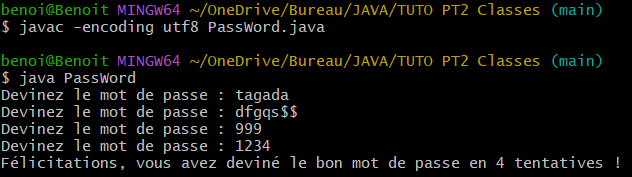

# TUTO JAVA - PARTIE 2

Ce tutoriel reprend la suite directe de la première partie, qui nous avait appris ce qu'est Java, son histoire, son intérêt, comment l'installer et toute une série de notions comme la compilation, l'exécution, les variables statiques, les différents types de variables primitives, une introduction à la variable String et tous les opérateurs de base. Nous avons déjà couvert les bases de Java.

Maintenant, nous devons aller un peu plus loin. Nous allons voir les **structures conditionnelles** telles que `if`, `else if`, et `else`, les opérateurs ternaires, ainsi que les boucles `while` et `for`. Toutes ces structures nécessitent une condition pour que le code commence ou cesse de s'exécuter, marquant le début de l'automatisation.

Avant d'aborder ce point, nous devons commencer par nous intéresser de nouveau à la structure d'une classe en Java, faire une seconde autopsie, pour découvrir la notion de **bloc d'instructions**, où il se situe dans la classe et comment nous pouvons jouer avec.

Enfin, nous verrons après la notion **d'objet**, qui va encore plus loin dans l'exploration de nos classes.

## 1. Seconde anatomie d'une classe Java

Reprenons ici notre classe `HelloWorld.java`, qui contient en fait bien plus des variables dignes d'un vaisseau spatial que du simple affichage d'une `String` "Hello World!".

```Java
public class HelloWorld {
    public static void main(String[] args) {
        // Présence du capitaine
        boolean capitainePresent = true;
        
        // Genre du capitaine
        char genreCapitaine = 'F';

        // Âge du capitaine (nombre entier de type int)
        int ageCapitaine = 45;

        // Nombre de missions complétées (nombre entier de type short)
        short missionsCompletees = 256;

        // Nombre de membres d'équipage (nombre entier de type byte)
        byte membresEquipage = 100;

        // Distance parcourue par le vaisseau en années-lumière (nombre entier de type long)
        long distanceParcourue = 123456789012345L;

        // Température du vaisseau (nombre flottant de type float)
        float temperatureVaisseau = 27.4f;

        // Température du vide spatial (nombre flottant de type double)
        double temperatureVideSpatial = 0.00000000000000000000000000000000000000001d;

        // Nombre de thermo-conteneurs dans le vaisseau (variable de type int non initialisée)
        int nombreThermoConteneurs;

        // Attribution d'une valeur à la variable nombreThermoConteneurs
        nombreThermoConteneurs = 500;

        // Variable "var" pour déclarer le nombre de canons
        var nombreCanons = 50;

        // Nom du vaisseau (chaîne de caractères)
        String nomVaisseau = "L'Anzu Céleste";

        // Devise du vaisseau avec des double-guillemets
        String deviseVaisseau = "\"Guidés par Shamash\"";

        // Affichage des informations du capitaine
        System.out.println("Hello, World!");
        System.out.println("Capitaine présent : " + capitainePresent);
        System.out.println("Genre du capitaine : " + genreCapitaine);
        System.out.println("Âge du capitaine : " + ageCapitaine + " ans");
        System.out.println("Missions complétées : " + missionsCompletees);
        System.out.println("Membres d'équipage : " + membresEquipage);
        System.out.println("Distance parcourue : " + distanceParcourue + " années-lumière");
        System.out.println("Température du vaisseau : " + temperatureVaisseau + "°C");
        System.out.println("Température du vide spatial : " + temperatureVideSpatial + "°C");
        System.out.println("Nombre de thermo-conteneurs sur le vaisseau : " + nombreThermoConteneurs);
        System.out.println("Nombre de canons sur le vaisseau : " + nombreCanons);
        System.out.println("Nom du vaisseau : " + nomVaisseau);
        System.out.println("Devise du vaisseau : " + deviseVaisseau);
    }
}
```

Si on regarde bien, il y a des choses qui devraient, de loin, vous rappeler le JavaScript. Il s'agit en fait des **accolades** ! Il y a en fait deux jeux d'accolades :

- Un qui commence directement après la déclaration de la classe
- Le second après la ligne d'instruction `public static void main` (que nous expliquerons bientôt, patience !)

Ce double-jeu d'accolades s'accompagne de trois niveaux **d'indentation** :

- Le premier, le plus près de la marge gauche, où on déclare la classe
- Le second juste en dessous la déclaration de variable, et est compris dans le *premier jeu d'accolades*
- Le troisième juste en dessous la ligne `public static void main`, et est compris dans le *second jeu d'accolades*

Ce que nous appelons le bloc d'instructions est compris au troisième niveau d'indentation/dans le second jeu d'accolades ! Et on l'appelle "bloc d'instructions" car c'est là que sont exécutées les différentes instructions !

Ce que je veux vous apprendre ici est double :

- D'abord, on peut avoir plusieurs blocs d'instruction différents, les uns en dessous des autres, dans l'ordre dans lequel on veut qu'ils s'exécutent, qu'on inclut dans le *second jeu d'accolades*, créant ainsi plusieurs jeux d'accolades étant tous à un *quatrième niveau d'indentation*.
- Ensuite, les variables peuvent être déclarées en dehors des sous-blocs d'instructions, juste sous la ligne `public static void main`, dans le *second jeu d'accolades*

L'idée ici, c'est que dans notre `classe`, précisément dans les blocs d'opération deux nivaux d'exécution : le niveau **global** qui concerne ce qu'il se passe au niveau du *bloc d'instruction principal* et le niveau **local**, qui ne concerne que chaque sous-bloc d'instruction spécifiquement.

Sachez aussi que vous pouvez avoir des sous-sous-blocs d'instructions indentés dans le bloc parent, mais cette pratique est à effectuer avec parcimonie, car on a vite fait de se perdre si on ne fait pas attention. Demandez-vous toujours, à la création d'un bloc d'instruction indenté, s'il est absolument nécessaire à votre code.

Voici un modèle pour illustrer :

```Java
public class OperationsDistinctes {

    public static void main(String[] args) {
        // variables globales
            
            //premier sous-bloc d'instructions
            {
                //variables spécifiques du premier sous-bloc d'instructions, pouvant combiner au besoin les variables globales
                //instructions du premier sous-bloc d'instructions
            }
            {
                //variables spécifiques du second sous-bloc d'instructions, pouvant combiner au besoin les variables globales
                //instructions du second sous-bloc d'instructions
            }
    }
}
```

Voilà comment on peut essayer de mettre les choses en pratique :

- Créer la classe OperationsDistinctes.
- Déclarer deux variables de type `int` comprises entre 0 et 9 en dehors des sous-blocs d'instructions.
- Avoir deux sous-blocs d'instruction.
- Dans le premier sous-bloc d'instruction, afficher une `String formatée` reprenant la somme de ces deux nombres. Créez la sous-variable d'addition pour votre sous-bloc d'instructions.
- Dans le second sous-bloc d'instruction, afficher une `String formatée` reprenant la différence entre ces deux nombres.  Créez la sous-variable d'addition pour votre sous-bloc d'instructions.

ATTENTION : il vaut mieux formater toutes ses variables au format `int`, ça rend les opérations moins aventureuses !

AUTRE CONSEIL : lorsque vous chercherez probablement à afficher des `String` pour les réponses de manière formatée avec `printf`, vos affichages seront traités les uns à la suite de l'autre, comme s'il s'agissait d'une même ligne, alors qu'il y en a deux distinctes. C'est l'occasion de vous introduire une commande spécifique à Java, quand on travaille sur des `String` et qu'on peut passer à la ligne, comme avec le `\n` en JavaScript. Pour Java, il s'agit de **`%n`**, que vous devrez mettre à la fin de la première `String formatée` que vous voudrez afficher !

Vous trouverez la correction dans le fichier "JAVA-SOLUTIONS.md".

Une fois que vous serez à l'aise avec cet exercice, créez vos propres codes avec variables globales, sous-blocs d'exécutions effectuant les opérations que vous demandez, histoire de vous amuser comme vous l'entendez !

### 1.2. Enregistrer la valeur d'un résultat d'un sous-bloc d'opérations au niveau global

Voici le dernier point spécifique que je veux aborder ici. Il n'est pas rare, quand on construit ses algorithmes, qu'on enregistre un résultat obtenu lors d'une étape pour l'utiliser ultérieurement.

Si vous vous rappelez des problèmes de géométrie au collège/lycée où l'on vous demandait, sur base de vos connaissances des axiomes de la géométrie euclidienne, de déduire l'amplitude d'un angle donné ou la longueur d'un segment de droite, il arrivait fréquemment que vous deviez réutiliser une valeur précédemment déduite pour avancer dans vos déductions.

En algorithmie, c'est pareil : on doit retenir des valeurs intermédiaires pour éventuellement les utiliser ultérieurement !

Pour ce faire, les variables que vous déclarez dans les sous-blocs d'opération doivent aussi être définies au niveau global, mais alors de manière non définie à l'image d'un `resultat;`, qui serait définie dans un sous-bloc d'opération comme étant, par exemple `resultat = variable1 + variable2;`; ce qui vous permettra, un `System.out.printf` à l'appui au niveau "global", de démontrer que le résultat obtenu a une existence au-delà du sous-bloc où sa valeur a été déterminée !

Pour comprendre, voici un code illustratif :

```Java
public class LocalToGlobal {

    public static void main(String[] args) {
        // Déclaration de variables globales
        int a = 5;
        int b = 10;
        int resultat; // Variable globale non initialisée

        // Sous-bloc d'instructions
        {
            int somme = a + b; // Calcul de la somme
            resultat = somme-6; // Enregistrement du résultat dans la variable globale
            System.out.printf("La somme de %d et %d est : %d%n", a, b, somme);
        }

        // Utilisation du résultat global en dehors du sous-bloc
        System.out.printf("Le résultat final enregistré est : %d%n", resultat);
    }
}
```

Si vous regardez bien ce code, cous voyez que le résultat de `somme` n'est utilisé qu'au niveau *local*, tandis que la valeur de `resultat` a une portée *globale*.

### 1.3. Conclusion récapitulative

Dans cette section, nous avons approfondi la compréhension de la structure d'une classe Java en nous concentrant sur les blocs d'instructions et les niveaux d'indentation. Nous avons appris qu'une classe peut contenir plusieurs sous-blocs d'instructions, chacun ayant ses propres variables spécifiques tout en accédant aux variables globales. Cette organisation nous permet de structurer et d'exécuter des instructions de manière ordonnée et efficace.

Nous avons également vu comment les variables peuvent être déclarées en dehors des sous-blocs d'instructions pour être utilisées dans différents contextes au sein de la méthode `main`. En pratiquant avec des exemples concrets, tels que la classe `OperationsDistinctes`, nous avons appliqué ces concepts pour mieux les comprendre et les maîtriser.

Enfin, nous avons illustré l'importance de l'enregistrement des résultats intermédiaires obtenus dans les sous-blocs d'instructions, et comment ces valeurs peuvent être utilisées globalement dans le programme. L'exemple de la classe `LocalToGlobal` a permis de démontrer cette pratique courante en algorithmie.

Maintenant que vous êtes à l'aise avec ces notions, vous êtes prêts à explorer les **structures conditionnelles**, qui vous permettront de contrôler le flux de votre programme de manière plus sophistiquée.

## 2. Les structures conditionnelles

Nous allons ici réviser un classique de la programmation, le **if... else** ! Même si vous connaissez sa logique et ses structures, commençons par un petit rappel strictement algorithmique de ce qu'est le `if... else`, comment il est censé fonctionner et ses usages concrets.

### 2.1. Le if... else, rappel d'une structure majeure en algorithmie

Le `if... else` est une structure logique centrale en programmation, car elle permet d'exécuter certaines instructions à certaines conditions. Jusqu'à présent, Java fonctionnait de manière **procédurale**, en exécutant les instructions les unes à la suite des autres, dans l'ordre où elles apparaissaient dans les unes en dessous des autres dans les lignes de nos IDE comme c'est mon cas ou l'IDE de votre choix.

Or, si la plus grande partie d'un programme s'exécute de manière procédurale, parfois, il faut que certaines choses puissent se faire sous certaines conditions ou laisser des choix à l'utilisateur.

Et des situations comme ça, on en rencontre tout le temps : vérifier qu'un mot de passe est valide, donner la possibilité dans un jeu au joueur de choisir un embranchement dans l'histoire principale, un algorithme qui permet de vérifier si els gens pointent à l'heure au travail, vérifier si le solde sur un compte bancaire est suffisant pour effectuer une transaction, si une trotinette électrique ou tout autre véhicule de mobilité partagée est présent dans les environs, ... la liste est longue.

Tout ça fonctionne grâce au ``if... else**`` qui va poser une **condition** qui a une valeur *booléenne*, qui se vérifie, ou non. Et en fonction de si la condition est vérifiée ou non, l'algorithme peut faire certaines choses au lieu d'autres, *exécuter un sous-bloc d'instruction spécifique plutôt qu'un autre*, on quitte la logique jusque-là utilisée de l'exécution d'un code de part en part. Maintenant, certains bouts du code seront exécutés sous certaines conditions, et d'autres sous d'autres conditions !

Tâchons de décomposer, algorithmiquement parlant, la manière dont fonctionne le `else... if`.

#### 2.1.1. La structure classique du `if ... else`

Pour comprendre comment fonctionne le `else... if`, commençons par une simple traduction : en français, ça signifie **"si... ou bien si"**. Et c'est la quintessence de cette notion : *SI* une condition donnée est remplie, alors on fait ceci. *OU BIEN SI* telle autre condition est remplie, on fait cela.

C'est comme ça que fonctionne l'achat d'alcool en magasin, si le vendeur respecte la législation en vigueur : *SI* le client est majeur, il peut acheter de l'alcool *OU BIEN SI* le client est mineur, il n'a pas le droit d'acheter de l'alcool. Il va de soi que le vendeur ne peut pas et vendre l'alcool et refuser la vente ! Seule une des deux opérations est possible. Et il faut que la condition qui la déclenche soit *vraie*, c'est-à-dire que sa `valeur booléenne soit égale à "true"` !

Et qui dit *valeur booléenne* dit **opérateurs relationnels** et dans une moindre mesure, **opérateurs logiques** ! C'est grâce à ces opérateurs qu'on peut vérifier si une condition est vérifiée ou non !

La manière dont les choses vont se structurer est la suivante : on va repartir de la structure avec plusieurs sous-blocs d'instructions, mais on va à chaque fois mettre au-dessus la condition, qui va permettre d'indiquer à java que le sous-bloc d'instruction en doit être exécuté que si la condition est remplie.

Prenons ce code, qui reprend les consignes données au videur du Macumba Fiesta, on fait rentrer que les gens qui ont 18 ans ou plus :

```Java
public class MacumbaFiesta {

    public static void main(String[] args) {
        // Déclaration d'une variable d'âge'
        int age = 18;

        // Condition initiale pour rentrer au Macumba Fiesta
        if (age >= 18) {
            System.out.println("Bonsoir, vous pouvez franchir les portes du Macumba Fiesta !");
        }

        // Situation dans laquelle la personne n'est pas majeure
        else if (age < 18) {
            System.out.println("Désolé, t'as rien à faire ici, rentre chez toi !");
        }
    }
}
```

Si vous compilez ce code et l'exécutez, vous verrez ceci :


Maintenant, si vous changez la variable d'âge par 9, que vous compilez le code et l'exécutez, voilà ce que vous verrez :


Maintenant, toute boite de nuit qui se respecte laisse rentrer les personnes majeures, et qui ne sont pas alcoolisées. Nous allons donc ajouter la variable `estAlcoolise` à notre code et affiner les conditions :

```Java
public class MacumbaFiesta {

    public static void main(String[] args) {
        // Déclaration d'une variable d'âge et d'une variable sur la quantité d'alcool ingéré'
        int age = 18;
        boolean estAlcoolise = false;

        // Condition initiale pour rentrer au Macumba Fiesta
        if (age >= 18 && estAlcoolise == false) {
            System.out.println("Bonsoir, vous pouvez franchir les portes du Macumba Fiesta !");
        }

        // Condition où la personne est majeure et alcoolisée
        else if (age >= 18 && estAlcoolise == true) {
            System.out.println("Ah je suis désolé, ça ne va pas le faire ! Revenez une prochaine fois !");
        }

        // Situation dans laquelle la personne n'est pas majeure
        else if (age < 18 && estAlcoolise == false) {
            System.out.println("Désolé, t'as rien à faire ici, rentre chez toi !");
        }
    }
}
```

Notez d'ailleurs dans ce code que j'utilise le double opérateur logique, car, si vous vous souvenez de la logique sur les opérateurs, il est dans ce cas important de d'abord se concentrer sur l'âge : si la personne qui veut rentrer est trop jeune, qu'elle soit alcoolisée ou non, elle ne peut pas rentrer !

Et si vous compilez et exécuter ce code, voici ce que vous obtiendrez, d'abord en définissant la variable d'âge à 18 ans ou plus et celle l'alcoolisation à "false", puis en gardant la même valeur de variable d'âge, mais en modifiant celle sur l'alcoolisation à "true" et enfin, en fixant l'âge à en dessous de 18 ans, peu importe la variable d'alcoolisation :


Ici, nous sommes dans les opérateurs logiques, avec l'opérateur `AND`, il faut que les deux variables, prises dans les expressions qu'on leur applique, soient vraies, soit avoir 18 ans et ne pas être alcoolisé. Et dans le cas présent, on s'assure avant toute chose que la personne est bien majeure.

Nous avons vu la logique générale. Voyons maintenant quelques particularités, comme le `else` seul à la suite d'une série de `if/else if`, ou alors de l'usage d'un `if` seul.

#### 2.1.2. Le `else` seul

Si vous avez fait du Java, ce qui est probable si vous suivez ce tuto, vous savez que souvent, une série de `if/else if`peut se terminer par un `else` seul, sans condition particulière. En réalité, il est là pour prendre en charge les cas de figure non prévus dans la chaîne de `if... else if`. Dans notre cas, nous avons explicitement prévu les cas où la personne est majeure et non alcoolisée, les cas où elle est mineure et non alcoolisée, et celui où elle est majeure et alcoolisée. C'est ce que nous avons défini de manière explicite. Cependant, il reste un cas de figure possible : celui où la personne a bu et est mineure ! C'est ici que le `else` rentre en ligne de compte pour couvrir ce cas de figure :

```Java
public class MacumbaFiesta {

    public static void main(String[] args) {
        // Déclaration d'une variable d'âge et d'une variable sur la quantité d'alcool ingéré'
        int age = 18;
        boolean estAlcoolise = false;

        // Condition initiale pour rentrer au Macumba Fiesta
        if (age >= 18 && !estAlcoolise) {
            System.out.println("Bonsoir, vous pouvez franchir les portes du Macumba Fiesta !");
        }
        // Condition où la personne est majeure et alcoolisée
        else if (age >= 18 && estAlcoolise) {
            System.out.println("Ah je suis désolé, ça ne va pas le faire ! Revenez une prochaine fois !");
        }
        // Situation dans laquelle la personne n'est pas majeure et non alcoolisée
        else if (age < 18 && !estAlcoolise) {
            System.out.println("Désolé, t'as rien à faire ici, rentre chez toi !");
        }
        // Cas non explicitement défini où la personne est mineure et alcoolisée
        else {
            System.out.println("Tu es mineur et alcoolisé, c'est doublement non !");
        }
    }
}
```

Ici, ce cas est facile à déduire. Mais en général, le `else` va surtout vous servir dans les vas où les gens entre des valeurs inexploitables dans un système. Par exemple, si vous demandez un nombre entier positif et que la personne entre un nombre à virgule, un nombre négatif ou une chaîne de caractères. Si votre algorithme prévoit tous les cas de figure où l'utilisateur entre les valeurs requises, le `else` va servir à afficher un message d'erreur en cas d'encodage de mauvaises valeurs, comme dans cet exemple :

```Java
public class InputValidation {
    public static void main(String[] args) {
        // Valeur encodée en dur
        int nombre = -5; // Vous pouvez changer cette valeur pour tester différentes situations
        
        System.out.println("La valeur encodée est : " + nombre);

        if (nombre > 0) {
            System.out.println("Vous avez entré un nombre positif : " + nombre);
        } else if (nombre == 0) {
            System.out.println("Erreur : Le nombre doit être supérieur à zéro.");
        } else {
            System.out.println("Erreur : Le nombre doit être positif.");
        }
    }
}
```

Ici, vous verrez que si vous rentrez une valeur sous zéro, ce sera traité par le `else` seul.

##### 2.1.2.1. Des conditions dans le sous-bloc Else ?

Il est parfois tentant d'ajouter des conditions supplémentaires dans le sous-bloc géré par un `else`. Bien que cette pratique soit possible, elle peut rapidement conduire à un code difficile à lire. En effet, si le `else` est souvent utilisé pour gérer un cas de figure par défaut, il est également possible d'y insérer des structures conditionnelles, des boucles, et d'autres blocs de code.

Le problème principal avec cette approche est l'augmentation des niveaux d'indentation. Dans nos exemples précédents, nous sommes déjà à trois niveaux d'indentation pour une simple instruction `else`. Ajouter des conditions supplémentaires peut rapidement porter ce nombre à cinq niveaux d'indentation, voire plus. Au-delà de cinq niveaux, la lisibilité du code commence à se détériorer, et à partir de sept niveaux, il devient crucial de réécrire le code pour le rendre plus clair.

**Mon conseil :** Évitez, dans la mesure du possible, d'ajouter des structures conditionnelles supplémentaires dans un `else`. Cherchez plutôt à traiter ces situations en dehors du bloc `else`, même si dans certains cas, il est plus approprié de le faire à l'intérieur. Avec l'expérience, vous apprendrez à évaluer la meilleure approche pour chaque situation.

**Note sur la lisibilité :** Ni des successions interminables de lignes de code ni des indentations innombrables ne favorisent une bonne lecture du code. Un compromis efficace pourrait être ce que j'appelle la "lecture diagonale", qui consiste à structurer votre code de manière à ce qu'il soit aussi long que large dans votre IDE. Cela facilite l'identification des différents blocs et rend le code plus facile à lire.

#### 2.1.3. Le `if` seul

Reste à parler du cas du `if` utilisé seul en début d'algorithme. Parfois, on peut empêcher l'exécution d'un long algorithme en vérifiant de manière préalable une condition unique qui, si elle n'est pas remplie, prévient l'exécution du reste de notre code. Reprenons notre code sur le Macumba Fiesta. En fait, il y a moyen de l'écrire autrement. Jusque-là, je m'étais employé à voir si la personne était majeur ET non alcoolisée. Une autre manière de procéder, plus simple, est tout simplement de d'abord vérifier l'âge : si la personne a en dessous de 18 ans, on n'exécute pas la suite du code, comme dans cet exemple :

```Java
public class MacumbaFiesta2 {

    public static void main(String[] args) {
        // Déclaration d'une variable d'âge et d'une variable sur la quantité d'alcool ingéré
        int age = 1è; // Vous pouvez changer cette valeur pour tester différentes situations
        boolean estAlcoolise = false; // Vous pouvez changer cette valeur pour tester différentes situations

        // Vérification de l'âge
        if (age < 18) {
            System.out.println("Désolé, t'as rien à faire ici, rentre chez toi !");
            return; // Arrête l'exécution du programme si la personne n'est pas majeure
        }

        // Vérification de l'état d'alcoolémie pour une personne majeure
        if (!estAlcoolise) {
            System.out.println("Bonsoir, vous pouvez franchir les portes du Macumba Fiesta !");
        } else {
            System.out.println("Ah je suis désolé, ça ne va pas le faire ! Revenez une prochaine fois !");
        }
    }
}
```

Le mot-clé ici qui doit vous intéresser ici est **return;** qui sert à marquer le fait qu'on arrête l'exécution du code et qu'on ne passe pas à la suite. Traduit dans la vie de tous les jours, si la personne a moins de 18 ans, ce n'est même pas la peine pour vérifier si elle est alcoolisée ou non. C'est seulement si cette condition se vérifie que le reste du code s'exécute, avec la seconde structure conditionnelle. Regardez d'ailleurs concrètement ce que ça donne :


La seule ligne affichée est celle concernée par le "if" isolé : si l'âge avait été bon, le programme n'aurait pas affiché ce message et serait passé au suivant. Ici, vu que la condition d'âge n'était pas remplie, le programme a affiché le texte prévu pour ce cas, et n'est pas allé plus loin grâce à l'instruction **return**.

Voyons maintenant une autre manière de traiter les alternatives, avec la **structure ternaire**.

### 2.2. La structure ternaire

En principe, si vous avez déjà appris les fondamentaux du Web Development, et les bases de l'algorithmie avec JavaScript, il est probable que vous ayez vu cette manière de poser une alternative, et que vous vous en serviez assez peu : il semble que ce soient les développeurs medior ou senior, plus à l'aise avec les formulations succinctes allant droit au but, évitant les `if... else` dès que possible, c'est-à-dire uniquement quand l'alternative ne propose que deux termes.

L'idée est de simplement demander à Java "est-ce que cette condition est remplie ?" et après d'écrire sur la même ligne quoi faire si la condition est vérifiée, et quoi faire si elle ne l'est pas.

Pour comprendre, analysons ce code :

```Java
public class VerificateurMajeur {
    public static void main(String[] args) {
        int age = 18;  // Définition de l'âge
        
        // Structure ternaire pour déterminer si la personne est majeure
        boolean estMajeur = (age >= 18) ? true : false;
        
        // Affichage du résultat
        System.out.println("Âge : " + age);
        System.out.println("Est majeur : " + estMajeur);
    }
}
```

Si vous regardez bien, le code se fait en trois temps : déclarer la variable qui va être utilisée dans la structure ternaire (ici `age`) et ensuite la structure ternaire. Regardons-la d'ailleurs de plus près :

```Java
boolean estMajeur = (age >= 18) ? true : false;
```

Au-delà de la déclaration de la variable booléenne `estMajeur`, c'est la manière dont on lui assigne sa valeur, en posant littéralement une question avec le `?` après la formule entre parenthèses ! Et après le point d'interrogation, on a l'alternative, où on assigne à `estMajeur` la valeur "true" si effectivement `age` >= 18, et après le symbole `:` la valeur à attribuer à `estMjeur` si `age` est inférieur à 18.

Enfin, quel que soit l'output de notre structure ternaire, on a un message final qui s'affiche, qui nous donne l'âge et la valeur booléenne attachée à la variable `estMajeur` !

Vous retrouverez d'ailleurs ce code dans le fichier `VerificateurMajeur.java`, dans le dossier "TUTO PT2 Classes".

La structure ternaire doit être intéressante à utiliser dans des codes plus conséquents en termes de longueurs et opérations à effectuer, pour gagner en lisibilité si l'affectation d'une variable a ne dépend que d'une vérification de la valeur de la variable b.

### 2.3. Le switch case

Nous avons vu pour l'instant une manière de traiter les conditions avec la structure conditionnelle. Nous avons vu qu'elle sert pour vérifier une condition sur une plage de valeurs comparée à celle d'une variable (pour rappel, les opérateurs relationnels, "plus grand", "plus petit", "égal" ne s'intéressent que rarement à des valeurs strictement équivalentes), offre plusieurs alternatives et laisse l'utilisateur "passif" face à son exécution.

Cependant, cette structure a certaines limites. D'abord, son aspect "passif" : tout est prédéterminé. Parfois, on aimerait aussi effectuer une opération spécifique en tant que tel et la structure conditionnelle ne nous le permet pas. Et un tel choix s'effectue avec une valeur précise.

C'est un peu comme le fonctionnement d'un choix de dialogue dans un RPG occidental comme Baldur's Gate ou le système de gestion de votre répondeur, où on vous demande d'appuyer sur 1 pour écouter vos messages, deux pour les archiver, etc. Chaque choix mène à une action spécifique, tout comme dans un **switch case**, où une valeur spécifique entraîne l'exécution d'un bloc de code particulier.

Ce dernier se structure, de manière abstraite, comme suit :

```Java
switch (expression) {
    case value1:
        // code à exécuter si l'expression correspond à value1
        break;
    case value2:
        // code à exécuter si l'expression correspond à value2
        break;
    // vous pouvez avoir autant de case que nécessaire
    default:
        // code à exécuter si aucune des valeurs précédentes ne correspond
        break;
}

```

Et dans un cadre plus large, cherchant à indiquer un jour de la semaine, voilà à quoi ça ressemblerait :

```Java
public class VerificateurJourSemaine {
    public static void main(String[] args) {
        int jour = 3;  // Définition du jour sous forme de nombre (1 = Lundi, 2 = Mardi, etc.)

        switch (jour) {
            case 1:
                System.out.println("C'est Lundi, le premier jour de la semaine de travail.");
                break;
            case 2:
                System.out.println("C'est Mardi, le deuxième jour de la semaine de travail.");
                break;
            case 3:
                System.out.println("C'est Mercredi, le milieu de la semaine de travail.");
                break;
            case 4:
                System.out.println("C'est Jeudi, le quatrième jour de la semaine de travail.");
                break;
            case 5:
                System.out.println("C'est Vendredi, le dernier jour de la semaine de travail.");
                break;
            case 6:
                System.out.println("C'est Samedi, c'est le week-end !");
                break;
            case 7:
                System.out.println("C'est Dimanche, c'est le week-end !");
                break;
            default:
                System.out.println("Nombre inconnu, veuillez entrer un nombre entre 1 et 7.");
                break;
        }
    }
}
```

Manipulez un peu avec le fichier "VerificateurJourSemaine.java" dans le dossier "TUTO PT2 Classes" pour voir les comportements concrets, en choisissant un nombre ou l'autre, pour voir ce qu'il en sort.

Une fois ceci fait, expliquons un peu ce code, les manipulations que vous avez effectuées rendant la compréhension plus facile :

Si vous avez avez assigné les valeurs 1, 4 et 7 à la variable `jour`, voilà les outputs que vous avez eu dans la console de Git Bash :


Comme vous voyez, tout se passe bien dans le meilleur des mondes : pour une valeur donnée en input, on a en output la réponse attendue correspondante. J'insiste sur ce point : contrairement au `if... else if...`, il n'y a pas de condition à vérifier. Pour un unique input correspond un unique output, là où pour le la structure conditionnelle, il y a systématiquement une gamme d'inputs pour un output unique.

Et mataintenant, réessayons notre code, mais cette fois-ci avec une valeur hors de de la gamme prévue. Voilà ce que nous avons en sortie :


`Default` est en quelque sorte comparable au `else` seul de la structure conditionnelle, c'est ce qui s'active quand on est dans le cas où la valeur en input ne correspond pas à la gamme des valeurs envisagées en ammont quand on développe le code.

Enfin, arrêtons nous sur le mot `break` qui clôt chaque `case`. Il sert en fait à arrêter l'exécution du code. Rappelez-vous : l'ordinateur, quand  un lit un fichier de code, il l'exécute ligne par ligne, ça ne va pas de soi pour lui de ne aps exécuter certaines lignes ou certains blocs. Si dans les structures conditionelles un jeu d'accolades permet de proprement isoler les choses, avec le switch, il faut compartimenter le code autrement, et c'est ici que le `break` entre en jeu.

Dans la structure `Switch`, le mot `case` indique à a JVM à aprtir de où elle doit exécuter le code et `break` lui indique où arrêter. Il suffit d'iaginer une voiture qui descend de l'autoroute à la bretelle voulue qui s'arrête en freinant là où on lui indique de le faire.

S'il n'y avait aucun `break`, le conde continuerait de s'exécuter. Pour vérifier cela, prennez le code de `VerificateurJourSemaine`, retirez les breaks et entrez pour `jour` la valeur 4 : voilà ce que vous aurez en output :


Le code n'ayant pas eu d'indications pour s'arrêter, il va continuer ligne après ligne jusqu'à arriver à son terme.

### 2.4. Les structures répétitives, aka les boucles

Les boucles sont la dernière structure de base que nous devons aborder. Elles permettent de répéter une ou plusieurs instructions données. Leur fonctionnement repose sur une condition logique, un peu comme dans un `if... else if` : on vérifie si une condition est remplie et on agit en conséquence. Autrement dit, une boucle dépend d'une *variable de type `int`* qui fixe les conditions de répétition. Cette variable contrôle le passage de la condition de vérification de `true` à `false`, ou inversement.

Répéter une opération présente plusieurs avantages : si vous devez exécuter la même instruction plusieurs fois, il est plus efficace d'utiliser une boucle plutôt que d'écrire le code de manière redondante. Cela vous permet de gagner en espace, en lisibilité, et en rapidité d'écriture.

Si vous avez fait du JavaScript, vous connaissez déjà probablement les concepts de base des boucles, et vous constaterez que la structure d'une boucle en Java est très similaire. Cependant, même si vous maîtrisez déjà ces notions, un petit rappel est toujours utile. Il est indispensable de bien comprendre ces structures élémentaires avant de passer à la manipulation des classes.

#### 2.4.1. La boucle for

La `boucle for` est probablement la plus utilisée. Elle fonctionne sur le principe que l'on sait à l'avance combien de répétitions sont nécessaires. Prenons l'exemple d'une routine sportive où on doit faire un certains nombre de pompes par série. On sait que l'on doit faire dix pompes pour avoir une série.

Nous pouvons l'écrire comme suit :

```java
public class Pompes {
    public static void main(String[] args) {
        for (int pompes = 0; pompes < 10; pompes++) {
            System.out.println("Pompe " + (pompes + 1));
        }
    }
}
```

Ce qui va nous intéresser ici en particulier, c'est l'expression **for (int pompes = 0; pompes < 10; pompes++)**. Nous avons d'abord le mot spécifique *for* qui indique le type de boucle qu'on va faire, et ensuite, dans les parenthèses, les paramètres, instructions pour faire tourner la boucle. En principe, vous savez lire et comprendre chacund es trois éléments dans les parenthèses. Maintenant, voyons voir à quoi correspond chacun d'entre eux :

- `int pompes = 0` est **l'initialisation** de la boucle, ça montre à partir de où, de quand on compte.
- `pompes < 10` est la **condition** à laquelle on fait tourner la boucle. Tant que la condition est vraie, on fait une répétition en plus.
- `pompes++` est **l'incrémentateur**, c'est à dire l'action effectuée à chaque répétition.

Notre code lu depuis le début nous donne donc, si on tente de le retranscrire en français, "en commençant notre compte pour la variable `pompes` à partir de 0, on va augmenter sa valeur de 1, et répéter cette opération tant que la valeur de ´pompes´ reste inféérieur à 10.

Exécuté, ce code nous donne ceci :


##### 2.4.1.1. Considérations sur la valeur de l'initalisation

Profitons-en pour faire un point sur *l'initialisation* : on voit dans les paramètres de la boucle qu'elle commence à 0, et qu'il faut pour l'output écrire ceci :

`System.out.println("Pompe " + (pompes + 1));`

Vous remarquerez que cela a aussi une influence sur la condition, où on spécifie que la boucle se répète tant que le nombre de `Pompes` est inférieur à 10.

Pourquoi avoir une initialisation qui commence à 0 et devoir ensuite réfléchir de manière contre-intuitive pour le reste ? 0 est la valeur à partir de laquelle beaucoup de choses sont énumérées en informatique, et cela remonte à l'époque où l'efficacité mémoire et la simplicité des calculs étaient primordiales.

Nous ne sommes plus à l'époque de Patrick Naughton et des autres pionniers où chaque bit comptait, mais cette convention reste pratique et largement utilisée aujourd'hui. Si vous trouvez plus intuitif de commencer à 1, vous pouvez le faire. L'essentiel est de rester cohérent dans votre code : si vous choisissez de commencer à 1, assurez-vous d'appliquer cette logique à l'ensemble de vos boucles et de vos conditions, sauf cas spécifique et pertinent.

##### 2.4.1.2. Déclarer "proprement" l'initialisation

Mais le code que je viens de vous montrer n'est pas la bonne, du moins pas la manière conventionnelle d'écrire un code. Comme pour l'exécution des pompes, il y a une manière "propre" et une manière "à l'arrache" d'écrire des boucles. Et ici, on l'ai fait à l'arrache ! Pour écrire proprement une boucle, on va devoir en fait d'éclarer la variable `pompes` en dehors de la boucle et pour *l'initialisation*, la déclarer avec une variable i. VOilà ce que ça donne :

```java
public class PompesPropres {
    public static void main(String[] args) {
        int pompes = 0;
        for (int i = 0; i < 10; i++) {
            System.out.println("Pompe " + (pompes + 1));
            pompes++;
        }
    }
}
```

Je ne vais pas vous montrer à quoi ressemble le code exécuté, le résultat est le même que celui montré plus haut. Ce qui nous intéresse ici, c'est le nom de variable pour *l'initialisateur* : ici, son nom est abstrait, il s'agit de `i`. Dans ce contexte, la variable `pompes` et l'initialisateur sont séparés. Ils n'ont aucune influence l'un sur l'autre, raison pour laquelle on est obligés dans d'ajouter dans notre algorithme `pompes++` après l'affichage de l'output.

Et on peut encore gagner un degré d'abstraction en faisant ceci :

```java
public class PompesParfaites {
    public static void main(String[] args) {
        for (int i = 0; i < 10; i++) {
            System.out.println("Pompe " + (i + 1));
        }
    }
}
```

Là, la vaariable `pompes` n'est même plus déclarée, mais l'output reste le même.

En fait, l'usage de cet *initilisteur* ayant le nom i nous vient directement de la notation mathématique. Voilà comment en maths, on écrit la somme de dix pompes partiant de 1 pour arriver à 10 :


Si vous regardez bien, nous avons là tous les paramètres de notre boucle : i commence à 0 (bas du symbole de somme), 9 est au dessus, car de 0 à 9 nous avons dix nombres et à droite du sybole de somme, la valeur qu'on incrémente à chaque fois ! Nous retrouvons là *l'initialisation*, la *condition* et enfin *l'incrémentateur* !

En somme (sans mauvais jeu de mot), nous avons là deux manières différentes d'écrire la même chose !

#### 2.4.2. La boucle while

##### 2.4.2.1. La boucle while d'un point de vue théorique

La boucle `while` adopte une approche différente de celle de la boucle `for`. Si, dans une boucle `for`, nous savons à l'avance combien de répétitions sont nécessaires, la boucle `while` est utilisée lorsque nous **ne connaissons pas le nombre exact de répétitions** à effectuer. Elle est particulièrement utile dans les situations où la boucle doit continuer à s'exécuter **jusqu'à ce qu'une condition spécifique soit remplie**. Cette condition, dont la valeur peut être imprévisible ou dépendre de facteurs externes, met fin à l'exécution de la boucle lorsque vérifiée.

Reprennons nos dix pompes et examinons le code de la boucle `while` :

```java
public class DixPompes {
    public static void main(String[] args) {
        int pompes = 0;

        while (pompes < 10) {
            System.out.println("Pompe " + (pompes + 1));
            pompes++;
        }
    }
}
```
Comme vous voyez, la boucle `while` ne prend en compte qu'un seul et unique paramètre.

A l'exécution sans surprise, nous avons les deix pompes qui s'affichent :


**ATTENTION !** Dans les boucles `while`, on a vite fait d'avoir des boucles infinies si on l'oublie l'incrémentation dans le code ! Par exemple, dans le code "DixPompes", retirez la ligne `pompes++;` et vous êtes parti dans une boucle infinie ! Refaites la compilation, l'eécution puis enfin appuyez vite sur `CTRL + C` pour obliger Git Bash à "tuer" le code, vous verrez un nombre hallucinant de lignes "Pompe 1" s'afficher !

##### 2.4.2.2. La boucle while : un exemple concret

Vous vous doutez bien que l'expemple précédent n'est pas une utilisation réelle du `while`, vu que là on connait déjà la condition d'exécution ! En fait, d'un point de vue utilisateur, on ne devrait pas voir le code et la valeur de la condition de la boucle ! Et un exemple concrêt, c'est l'utilisation d'un **Guess the number**, un petit code où on permet à l'utilisateur de rentrer une valeur et de voir s'il trouve la bonne réponse. Et tant qu'il ne trouve pas la bonne réponse, la boucle redémarre, imposant au joueur un autre essai. Le but du jeu est d'arriver à trouver le nombre.

Voilà ce code :

```java
import java.util.Scanner;

public class GuessTheNumber {
    public static void main(String[] args) {
        Scanner scanner = new Scanner(System.in);
        int nombreADeviner = 7;
        int essai = 0;  // Initialisation de la variable essai
        int nombreDeTentatives = 0;  // Initialisation du compteur de tentatives

        while (essai != nombreADeviner) {
            System.out.print("Devinez le nombre : ");
            essai = scanner.nextInt();
            nombreDeTentatives++;  // Incrémente le compteur à chaque tentative
        }

        System.out.println("Félicitations, vous avez deviné le bon nombre en " + nombreDeTentatives + " tentatives !");
    }
}
```

Avec ce code, l'utilisateur devra entrer des valeurs au fur et à mesure dans GitBash jusqu'à  trouver la bonne valeur, sans connaite la valeur de `nombreADeviner` ou pouvoir la voir. Voilà à quoi ça ressemble :


Et il y aura autant d'essais à faire que nécessaire, jusqu'à trouver la bonne valeur :


Ici, la bonne valeur termine la boucle et remplit la condition `while (essai != nombreADeviner)` !

**NB :** Dans cet exemple, j'utilise un outil appelé `Scanner` pour demander à l'utilisateur de saisir une valeur. Je ne vais pas expliquer en détail comment `Scanner` fonctionne pour l'instant. Ce que vous devez savoir pour le moment, c'est que `Scanner` permet de récupérer la valeur que l'utilisateur entre dans le programme. Nous verrons plus tard ce qu'est exactement `Scanner` et comment l'utiliser en profondeur.

#### 2.4.3. La boucle do while

Enfin, il reste à voir une dernière boucle qui est en fait plus une variante de la boucle `while` qu'un troisième type de boucle à part entière. Mais dans un soucis pédagogique, la boucle `do while` est traite à part dans ce tutoriel, car son usage est assez spécifique.

Si jusqu'à présent les boucles `do` et `while` n'exécutaient du code qu'une fois lancées, il y assez souvent besoin de d'abord effectuer une instruction avant de voir si une condition est vérifiée ou non.

Je vais vous présenter ça avec deux cas : un cas théorique qui montre la logique du `do while`, et un autre déjà plus proche de ce qu'on fait concrètement en développement.

##### 2.4.3.1. La boucle do while d'un point de vue théorique

Une fois n'est pas coutume, on va revenir sur nos fameuses dix pompes, qui vont nous montrer la légère subtilité existant entre le `do while` et le `while`. Et pour ce faire, observons d'abord le code :

```java
public class EncoreUnePompe {
    public static void main(String[] args) {
        int pompes = 0;  // Initialisation du compteur de pompes

        do {
            pompes++;  // Incrémentation du nombre de pompes
            System.out.println("Pompe " + pompes);
        } while (pompes < 10);  // La boucle continue tant que moins de 10 pompes ont été faites

        System.out.println("Ouf, enfin terminé ! Vous avez fait vos " +pompes+" pompes !");
    }
}
```

Si vous comparez avec la classe *Dix pompes*, vous remarquerez que l'incrémentateur `pompes++` ne se trouve plus en dessous du paramètre de notre boucle while, mais au dessus ! Et vu qu'un programme exécute un code ligne par ligne, instruction après instruction, l'idée est qu'on incrémente **AVANT** de vérifier la condition !

Et si l'output dans ce cas est convaincant :


Mais maintenant, pour vous montrer que, vraiment, il y a d'abord une instruction d'exécutée avant de vérifier la condition, passez le paramètre de la boucle `while` ici à *==0;* et observez ce qu'il se passe :


Une pompe est effectuée, même si derrière la boucle s'arrête de suite !

##### 2.4.3.2. La boche do while avec un exemple concret

Maintenant, voyons voir avec un exemple proche de la vraie vie, celui de la vérification d'un mot de passe. Avant toute chose, surtout si vous avez des bases en sécurité et avec les JWT par exemple, ce que je vais écrire va vous faire hurler, et je ne vais certainement aps présenter les bonnes pratiques du point e vue sécurité. Mais enr evanche, la logique, elle est bonne.

Partons d'un code dans lequel on enregistre en dur un mot de passe, et proposons aux gens de d'abord entrer une tentative, qui se répètera jusque à entrer le bon code, où on affichera un message de félicitations :

```java
import java.util.Scanner;

public class PassWord {
    public static void main(String[] args) {
        Scanner scanner = new Scanner(System.in);
        String motDePasse = "1234";
        String essai = "";  // Initialisation de la variable essai
        int nombreDeTentatives = 0;  // Initialisation du compteur de tentatives

        while (!essai.equals(motDePasse)) { // Usage de la émthode equals qui compare deux String
            System.out.print("Devinez le mot de passe : ");
            essai = scanner.nextLine();  // Lire l'entrée utilisateur comme une chaîne
            nombreDeTentatives++;  // Incrémente le compteur à chaque tentative
        }

        System.out.println("Félicitations, vous avez deviné le bon mot de passe en " + nombreDeTentatives + " tentatives !");
    }
}
```

Voilà ce que ce code va donner :



Avant de vérifier une quelconque condition pour entrer un mot de passe est d'au moins permettre çà l'utilisateur d'entrer quelque chose. La vérification, en toute logique, ne survient qu'après.

**NB :** J'utilise ici ce qu'on appelle la *méthode equals*, qui sert à vérifier si deux objets, comme des chaînes de caractères, ont la même valeur. Pour les types primitifs (comme `int`, `float`, etc.), on utilise les opérateurs relationnels comme `==` pour comparer les valeurs. Nous reviendrons dessus de manière plus approfondie ultérieurement. Pour l'instant, retenez que ça sert à vérifier si deux `String` sont identiques.

## 3. Exercice de synthèse

Pour conclure cette seconde partie du tutoriel, je vous propose un exercice de synthèse basé sur le code de vérification du mot de passe. Dans cet exercice, vous allez limiter l'utilisateur à trois tentatives, ce qui implique d'ajouter une deuxième condition à la boucle `while`. Vous devrez également déclarer une variable pour compter le nombre de tentatives, ainsi qu'une autre pour vérifier si la réponse est correcte.

**Indices :**

- Utilisez un compteur pour suivre le nombre de tentatives.
- Combinez les conditions de la boucle avec un opérateur logique (`&&`).
- Utilisez une variable booléenne pour indiquer si la réponse est correcte ou non.
- Utilisez la méthode `equals` pour comparer les chaînes de caractères.

Cet exercice vous permettra de manipuler différents types de variables, ainsi que divers opérateurs logiques, arithmétiques et relationnels, tout en renforçant votre compréhension des structures conditionnelles.

## 4. La suite

Nous voilà arrivés au bout de cette autre section du tutoriel, où nous avons attaqué un gros bout, consacré aux strictures conditionnelles, au boucles et tout ce qui s'y rapproche. Avec ce que nous avons vu dans la première aprtie du tutorial, nous possédons maintenant tous les outils de base pour pouvoir effectuer de nombreuses opérations.

L'étape suivante va nous faire rentrer dans le coeur de Java, en attaquant le vaste domaine de la programmation objet, des classes et des manipulations que nous pouvons faire d'une classe à l'autre, l'occasion aussi de voir les fonctions !
