# TUTORIEL Java

Bienvenue dans ce tutoriel Java ! Dans la longue liste des langages de programmation, nous allons explorer ici Java, un langage polyvalent et très demandé sur le marché du travail.

## 1. Pourquoi un tutoriel Java ?

Pour planter le décor, j'ai suivi une formation de développeur web centrée sur la stack MERN, ce qui m'a appris à être polyvalent rapidement. JavaScript, étant la "langue commune" de cette stack, est utilisé tant pour le back-end (Node.js et Express) que pour le front-end (React).

Cependant, il est clair que sur le marché de l'emploi, la stack MERN n'est pas toujours explicitement demandée. Plus interpellant encore, Node.js semble relativement boudé en Europe actuellement. En revanche, Java est un nom qui revient fréquemment dans les offres d'emploi, bien plus que Node.js. Arrêtons-nous un instant sur le marché de l'emploi.

### 1.1. Le marché du Back-End

Si l'on regarde l'offre du marché côté back-end web, on remarque que Node.js est à la traîne et qu'il y a deux principaux challengers : PHP (avec ses frameworks Symfony et Laravel) et Java (avec son framework Spring). Il existe aussi d'autres approches comme C#/.Net  (.Net est en fait LE framework de C#), Python, Ruby ou Perl, mais les deux derniers sont anecdotiques sur le marché européen actuellement, et les deux premiers sont des machines de guerre calibrées pour des projets massifs comme des programmes de bureau, et/ou à faire tourner sur des machines puissantes, plutôt que pour du Back-End web, même s'ils accomplissent cette tâche haut la main.

#### 1.1.1. PHP

PHP est au back-end web ce que Booba est au rap français, l'empereur assis sur son trône. Présent depuis le début, ce langage à la syntaxe parfois complexe a su, comme le rappeur de Boulogne-Billancourt, toujours se réadapter, être sur la balle, et rester numéro 1. On a souvent prédit sa mort et pourtant, il continue à faire tourner 70% de l'Internet mondial, CMS Wordpress et stacks de développement comme WAMP, XAMPP, LAMP et les autres compris niveau back-end. Rien que pour sa culture, il est important d'avoir touché à PHP si on se prétend développeur web.

#### 1.1.2. Java

Maintenant que je pense avoir été honnête vis-à-vis de PHP, voyons pourquoi, selon moi, apprendre Java et son framework Spring est beaucoup plus intéressant... et amusant.

D'abord, Java ne se limite pas au web. Si vous apprenez Java, vous pouvez en réalité vous diversifier : web, applications Android, applications de bureau, etc. Bien entendu, on pourrait rétorquer que, par exemple, Node.js peut aussi permettre de développer des applications de bureau. Mais soyons honnêtes, Node.js n'est pas, de base, calibré pour développer des applications "lourdes", là où Java en a déjà plus la stature.

De plus, Java est un "poids moyen", entre les langages "légers" comme JavaScript et Python, mais tout de même moins complexe que C#/.NET. Dit autrement, là où JavaScript et Python sont des langages dits de **haut niveau**, proche du lange humain et C# un langage de plutôt **bas niveau**, plus proche du langage machine, Java se retrouve entre les deux, dans un un certain équilibre. L'atuce tient aussi au fait qu'entre Java et le langage machine, il y a la compilation en Bytecode qui rend votre code Java très proche du langage machine, nous y reviendrons.

Java nous inculque de la rigueur, notamment par son aspect très explicite et verbeux, dans l'assignation des types de variables, le fait qu'il passe systématiquement par la programmation orientée objet, tout en évitant les aspects techniques comme la gestion manuelle de la mémoire ou les pointeurs qu'on retrouve beaucoup dans les langages de bas niveau.

Et comme dit plus haut, Java est un langage tout terrain, et adapté à des projets robustes. Je m'explique :

1. Java est **multi-thread** : si vous vous rappelez de la métaphore de l'atelier du Père Noël de mon tutoriel sur le Back End, ça veut dire que vous avez dans l'atelier plusieurs Pères Noël bossant chacun sur une tâche particulière. Et il y a en plus autre chose à considérer avec ça : Java peut-être bloquant ou non-bloquant en fonction de vos besoins, de vos envies, de vos frameworks, ... Ça permet de faire une petite remarque matérielle, montrant que la programmation dépend aussi des architectures hardware : Java est un langage "processeur multi-cœurs-friendly", qui peut utiliser différents cœurs pour exécuter des tâches en parallèle, là où JS, par exemple, a plus une philosophie mono-cœur.
   
2. Java a aussi pour lui d'être un langage qui **compile**. Dit autrement, ça veut dire que Java, en exécutant votre code, va dans un premier temps le "traduire" en Bytecode, qui est un langage "intermédiaire" entre le Java et le binaire. Ensuite, si votre système a, ou qu'en bon.ne développeur.se vous avez installé la Java Virtual Machine (et spoiler alert, en général, quand vous installez Java, la JVM vient aussi avec), celle-ci traduira le Bytecode en instructions intelligibles pour votre système. Dit autrement, si vous développez en Java sur Windows, votre script sera exécutable dans des environnements Android, Linux, macOS, en minimisant les déconvenues !

Mais d'ailleurs, qu'est-ce qui a mené à développer Java, et d'où vient-il ?

### 1.2. L'histoire de Java

Nous sommes en 1994, dans les bureaux de Sun Microsystems. Patrick Naughton, James Gosling, Mike Sheridan et leurs collègues piétinent depuis plusieurs jours : le projet Stealth sur lequel ils travaillent n'avance pas ! En cause ? Le système embarqué sur lequel ils doivent travailler n'est pas compatible avec C++, leur langage de travail : problèmes de mémoire, de sécurité, ressources limitées et problèmes de portage facile sur d'autres appareils et plateformes.

Décidément, C++ ne convient pas, et il faut d'autres outils. Nos amis commencent alors à cogiter. Il leur faut le meilleur de C++ et le meilleur de Mesa (un langage qui n'est plus utilisé actuellement), en combinant la simplicité syntaxique et l'orienté objet du premier, et la robustesse et la sécurité du second. Et en même temps qu'ils avancent sur le Projet Stealth, rebaptisé depuis Green Project, ils peaufinent leur outil et en 1994, ça y est, Oak, qui sera vite rebaptisé Java pour des histoires de droits, est né !

Et si Java a d'abord été pensé pour les composants embarqués, le fait qu'il soit facilement portable d'un environnement à l'autre (rappelez-vous de la compilation en Bytecode, l'idée de procéder ainsi date des débuts même de Java !), 1994 est aussi l'année où une technologie qui changera nos vies et la face de l'humanité émerge : Internet ! Et autant dire qu'Internet, à ses débuts, n'était pas très harmonisé, et Java, avec la compilation en Bytecode, s'est imposé comme un outil de premier choix côté client pour gérer des animations, des petits jeux et autres choses du genre sous forme de scripts, microprogrammes, dans des balises HTML telles que `<applet>` ou `<object>`, dans la mesure où le CSS était encore à ses balbutiements, bien loin du CSS 3 que nous connaissons aujourd'hui.

De plus, Java arrivait aussi à faire des requêtes asynchrones, via une classe spécifique de Java, *servlet* (un programme Java qui s'exécute sur un serveur et permet de gérer des requêtes et des réponses), permettant alors d'interagir avec des bases de données et des API. À une époque où JavaScript avait des problèmes de compatibilité entre navigateurs, Java était le langage pour les requêtes asynchrones avec un serveur. Mais le temps passant, JavaScript s'améliorant, HTML et CSS prenant en charge de plus en plus de fonctionnalités, le recours à des applets Java est devenu de plus en plus encombrant et contre-performant.

Par contre, Java a réussi sa "reconversion", étant encore utilisé côté serveur, permettant d'encapsuler le code dans des classes, ce qui est appréciable dans le cadre de sites et d'applications web sensibles, comme des sites internet bancaires ou d'assurance, où il s'agit de ne pas diffuser de données sensibles ou de donner involontairement accès à l'architecture de son programme, exposant au grand jour les failles potentielles.

Enfin, Java reste un programme central dans le développement d'applications et programmes multi-plateformes, en particulier sur Android, où il est un des langages, si pas le langage phare qui fait tourner la plupart des applications sur nos téléphones.

Cet exposé historique a pour but de montrer comment Java est né, en répondant à quels besoins, à quel point il est encore utilisé aujourd'hui, des domaines très variés, y compris en web où sans prétendre faire de l'ombre à PHP, il est néanmoins incontournable dans les situations où la sécurité est primordiale.

Maintenant que nous connaissons les spécificités de Java, son histoire, et comment il se situe par rapport à d'autres langages, attaquons son installation !

### 1.3. Installer Java

Après avoir vu pourquoi il est pertinent d'apprendre Java et son histoire, voyons maintenant comment installer Java et configurer VSCode pour pouvoir l'utiliser ! En effet, tout langage de programmation que l'on veut utiliser, sauf dans certaines distributions Windows (ou autres OS), doit être téléchargé. Ensuite, nous devons configurer VSCode pour qu'il puisse servir d'environnement de développement pour Java !

#### 1.3.1. Vérifier si Java est déjà installé

La première étape consiste à vérifier si vous avez Java installé sur votre bécane. Pour ça, ouvrez votre terminal Git Bash et entrez la commande suivante :

java -version

Et là, deux possibilités : 

- Soit tout va bien dans le meilleur des mondes et vous avez Java d'installé. La console vous dira également quelle est la version "par défaut" que votre système utilise (sachant qu'on peut avoir plusieurs versions d'un langage installées sur une machine).
- Soit Java n'est pas installé, c'est-à-dire "not found".

Voilà le message si vous avez Java d'installé (dans mon cas, je bosse sur Java 17 d'Oracle) :
 
$ java -version
java version "17.0.11" 2024-04-16 LTS
Java(TM) SE Runtime Environment (build 17.0.11+7-LTS-207)
Java HotSpot(TM) 64-Bit Server VM (build 17.0.11+7-LTS-207, mixed mode, sharing)

Et le message si vous n'avez pas Java :

bash: java: command not found

Et soit dit en passant, faites ça, dans le doute, pour tout langage de script que vous voulez utiliser pour un projet si vous avez un doute, que ce soit Java, JavaScript, Python, PHP, C#, ... la liste est longue ! Et pour chacun de ces langages, la commande est susceptible de légèrement varier, vu qu'il n'y a pas de pratiques harmonisées en la matière. Donc, renseignez-vous.

Maintenant, partons du cas de figure probable où vous n'avez pas Java sur votre machine, et il faut l'installer.

#### 1.3.2. Installer Java

Partons de l'hypothèse où vous n'avez pas Java installé sur votre bécane, ce qui est par ailleurs le plus probable. Il faut donc l'installer. Et comme en informatique/programmation il y a de multiples voies pour résoudre un problème, il faut en choisir une. Pour ma part, j'ai choisi de passer par [le site d'Oracle](https://www.oracle.com/java/technologies/downloads/?er=221886), qui a racheté Sun Microsystems en 2010 et est donc propriétaire de Java, même s'il reste (pour l'instant ?) dans la philosophie open source qu'était celle de Sun Microsystems.

Sur le site d'Oracle, vous aurez une pléthore de versions installables, sur différents OS. Mais à bien y réfléchir, on ne va pas utiliser les versions d'Oracle, car il semble qu'ils veuillent abandonner l'open source et faire payer des licences annuelles dans un futur proche. Donc, on change notre fusil d'épaule et je vous propose de passer par Adoptium, un groupe composé de programmeurs qui proposent des versions en libre accès à Java, depuis qu'Oracle a commencé, en 2017, à émettre l'idée que chez eux, Java pourrait passer sous licence.

Rendons-nous donc [sur leur page d'archive](https://adoptium.net/fr/temurin/archive/) et cliquons sur le menu déroulant :

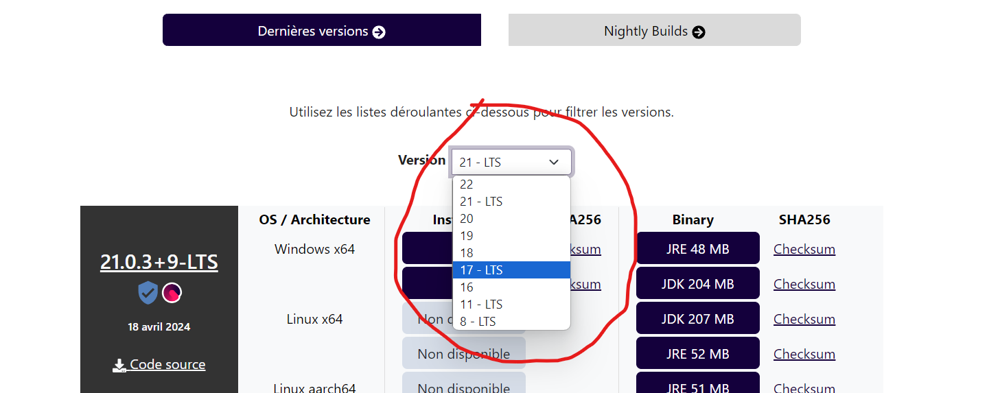

Dans le cadre de ce tuto, nous allons travailler avec des versions LTS, pour Long Term Support, ce qui veut dire que ces versions seront révisées et entretenues. Nous allons ici télécharger les LTS 17 et 21, soit une version ancienne mais stable et encore largement utilisée, et une version récente proposant les fonctionnalités les plus récentes et autour de laquelle la communauté semble se fédérer petit à petit.

À chaque fois, on vous propose le JDK pour "Java Development Kit" et le JRE pour "Java Runtime Environment". La différence entre les deux tient au fait que le JRE ne contient que la Java Virtual Machine et les bibliothèques et fichiers permettant de faire tourner vos codes compilés en Bytecode, tandis que le JDK contient en plus du JRE le compilateur et de quoi lancer un programme écrit en Java. Autant vous dire qu'il faut télécharger les JDK, et pas seulement les JRE !

Ensuite, il faut voir quelle version installer sur Windows : les x64 (pour 64 bits) ou les x86 (pour 32 bits) ? Pour le savoir, lancez la commande suivante dans Git Bash :

uname -m

Et là, si vous avez en output x86-64, ça veut dire que vous devez télécharger les versions de JDK pour des installations Windows avec des processeurs 64 bits. En revanche, si vous avez en output i686 ou i386, vous pouvez télécharger les versions compatibles pour Windows avec des processeurs 32 bits.

Maintenant que nous savons quelles versions installer, facilitons-nous la vie et téléchargeons les versions les plus récentes de JDK 17 et JDK 21 compatibles avec nos processeurs respectifs, et avec installateurs, pour ensuite lancer les deux.

Maintenant, j'ai trois versions de JDK sur mon PC : JDK 17 d'Oracle et JDK 17 et 21 d'Adoptium. Je roule par défaut avec JDK 17 d'Oracle et je veux passer sur JDK 17 d'Adoptium car bien installée, plus stable que la 21 (qui n'est pas catastrophique pour autant, sachons mesure garder), qui a un bon niveau de maturité et qui rencontrera moins de soucis de compatibilité avec des frameworks ou des bibliothèques. Et si un jour je veux passer sur la 21, je n'aurai qu'à suivre les instructions ci-dessous !

#### 1.3.3. Choisir la version de Java sur laquelle on veut travailler par défaut

Maintenant que vous avez deux versions de JDK sur votre machine (moi  trois), il faut voir laquelle est celle utilisée ou utilisable apr défaut par votre machine avec "java -version" que vous utilisez dans Git Bash.

Pour ma part, Git Bash indique ceci :

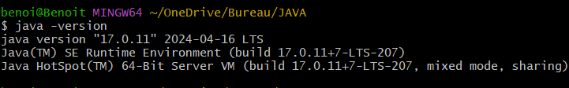

Le "TM" entre parenthèse est un signe qui ne trompe pas, c'est du trademark, soit la version commerciale d'Oracle, et je veux changer ça.

Pour ça, je vais modifier deux choses, la **variable d'environement**, qui me sert à dire aux programmes qui font tourner Java *quelle version* de Java utiliser, et au besoin le **PATH**, le chemin, qui me sert à dire à dire aux programmes qui peuvent utiliser Java *où* trouver la version à utiliser.

#### 1.3.4. Définir la variable d'environnement (et le chemin)

D'abord, on va modifier la variable d'environnement qui lie Java à la version qu'on va utiliser.

Pour ça, dans le menu démarrer de Windows, on va d'abord chercher les **paramètres système avancés** dans le menu de démarrage pour les ouvrir, pour ensuite cliquer sur le bouton "variables d'environnement :

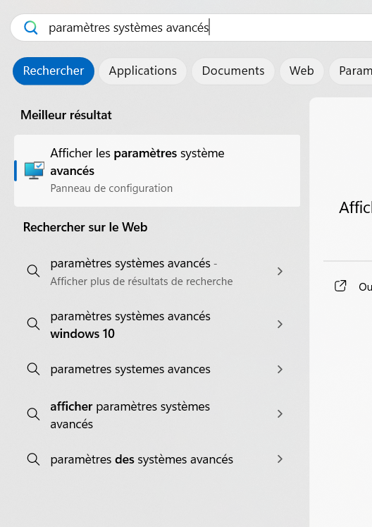

*Trouver les paramètres système*

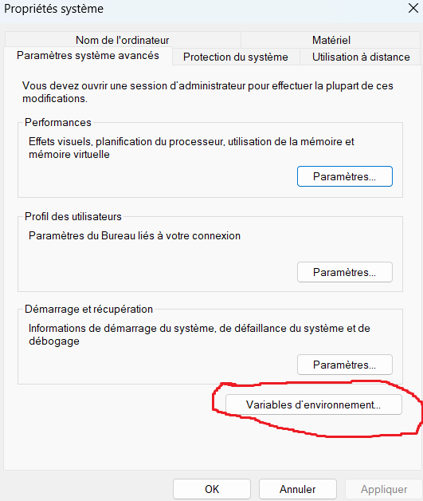

*Le bouton des variables d'environement*

Une fois dans les variables d'environement, on va chercher dans les variables systèmes si par hasard, il n'y aurait pas déjà quelque chose en rapport avec un quelconque "path", et là, j'ai eu cette énorme surprise :


Et en sélectionnant "Path" et en cliquant sur "modifier", la surprise n'a fait que s'emplifier : sur une variable, j'ai accès à tous les langages d'installés sur ma bécane !

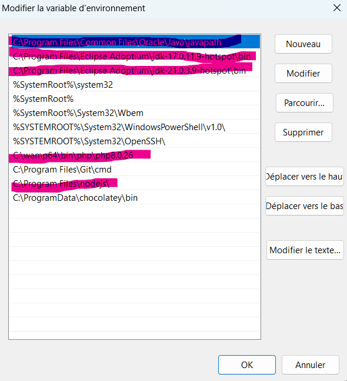

En dehors de Python que j'ai aussi sur ma machine qui ne semble pas avoir de variable d'environnement ststème propre, j'ai sous "path" tous les chemins qui mènent à mes autres langages installés ! Et si vous installez automatiquement les choses comme moi, il y a de fortes chances que vous trouviez tout comme moi sous "path" toutes vos installations de Java !

Là, je n'ai plus qu'à sélectionner la version de JDK 17 d'Adptium que je veux mettre en avant et à cliquer sur "déplacer vers le haut"

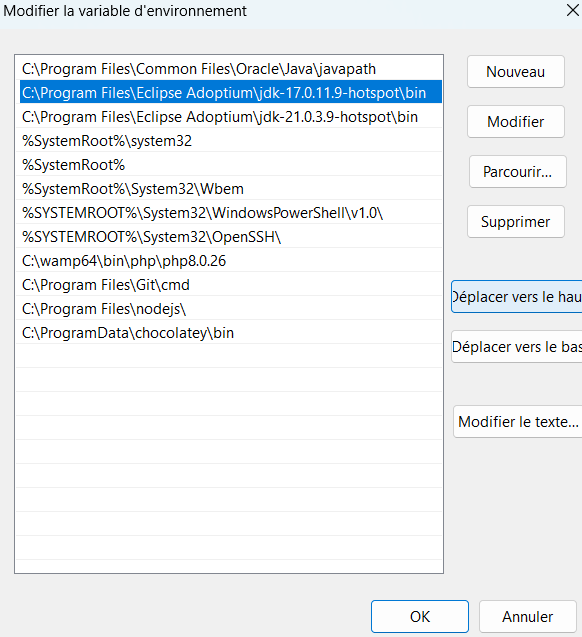

A le emttre tout en haut de la liste

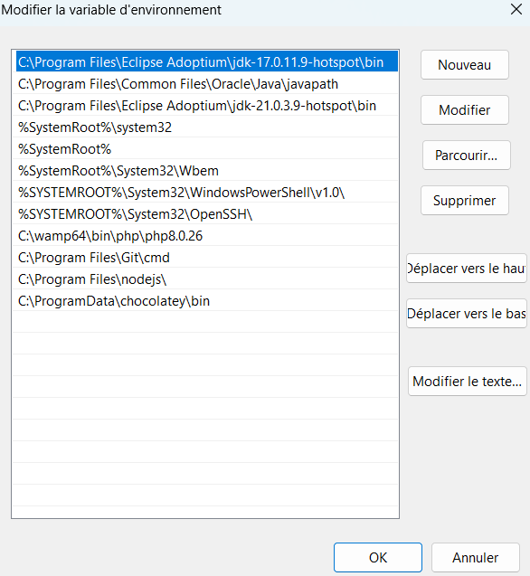

Et à cliquer sur "ok" pour revenir aux paramètres système avancés et à cliquer sur "ok" pour les refermer.

Et en fermant Git Bash et en le ré-ouvrant, en utilisant la commande "java -version", vous verrez que la version utlisée par défaut aura changé !

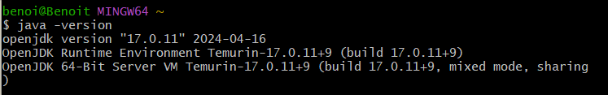

Vous voyez, j'ai maintenant la version JDK 17 d'Adoptium comme version de Java utilisée par défaut sur mon ordinateur ! Et si un jour je veux utiliser la 21 par défaut, j'aurai juste à retourner dans les paramètres système avancés, dans les variables d'environnement, dans les variables système, et dans path, à mettre en avant JDK 21 d'Adoptium !

#### 1.3.5. Les extentions pour VSC

Maintenant qu'on a installé différentes versions du JDK de Java et choisi celle qu'on veut utiliser, reste à installer les extensions pour VSC afin d'utiliser au mieux Java ! Il est même probable que VSC vous les propose par lui-même quand il détecte que vous allez coder en Java, ou que vous créez un document Java.

Et toutes ces extentions sont réunies dans un "pack", le "Extention pack for Java", qui va colorer votre code, gérer des fonctionnalités typiques de Java, proposer un debbuger propre à Java, in manager de projets, et j'en passe.

Avec tout ça, vous serez paré pour aprtir à la découverte du Java !

##### Des alternatives à VSC ?

Reste à aborder un point : si on doit installer tellement d'extentions à VSCode pour faire tourner Java comme il faut, il y a bien une raison, c'est que de base, VSC n'a pas de vocation à faire tourner du Java. Et pour être tout à fait sérieux, il y a des environnements de développements intégrés qui ne s'occupent que de Java, et bien mieux que VSC, dans la mesure où ils sont conçus et calibrés pour. Pour enciter quelques uns, il y a IntelliJ IDEA, Eclipse et NetBeans pour les plus connus.

Si vous ne voulez développer qu'en Java, en faire votre seul alngage matin, midi et soir pour le reste de votre vie, envisagez au moins de les tester. Mais si vous venez d'une culture plus web dev avec des tas de fichiers écrits dans différents langages, alors VSC reste indiqué, et est malgré tout, un très bon IDE avec lequel on peut déjà faire beaucoup de choses en Java.

## 2. Hello, World !

Maintenant qu'on a présenté Java, nous allons voir comment il fonctionne concrètement à travers le traditionnel affichage du message "Hello World !"

Voilà comment on fait en javascript :

```javascript
console.log("Hello, World!");
```

Et ici, en PHP :

```PHP
<?php
echo "Hello, World!";
?>
```

On remarque que ça tient globalement en peu de lignes : parfois une, parfois trois, quand il y a des balises spécifiques.

En Java, c'est une autre paire de manches :

```Java
public class HelloWorld {
    public static void main(String[] args) {
        System.out.println("Hello, World!");
    }
}
```

Le premier choc passé, décomposons !

### 2.1. Anatomie d'une classe intimidante

On part là sur cinq lignes et beaucoup, beaucoup de texte, comparé à JS ou PHP ! Mais tentons de décomposer. Au milieu, on a l'instruction qui demande au système d'afficher du texte : "Hello, World !" ; d'où la suite de caractères "System.out.println". Petite remarque en passant : Java est sensible à la casse, attention à être scrupuleux avec vos majuscules !

En première ligne, on voit un mot qui rappelle une notion vue en JS, les **Classes** ! Ici, elle est publique, c'est-à-dire que tout le monde a accès à son contenu (j'expliquerai plus tard comment ça fonctionne). En seconde ligne, nous avons la méthode principale de la classe. Nous reviendrons sur cette ligne plus tard. En résumé, on a une classe "HelloWorld" qui a pour but d'afficher "Hello, World !" dans la console.

### 2.2. Compiler, exécuter

Pour commencer, créez un dossier Java dans lequel vous allez mettre ce tuto, et créez un document "helloworld.java". Pour l'instant, dans la barre de gauche sur VSCode, vous aurez ceci :

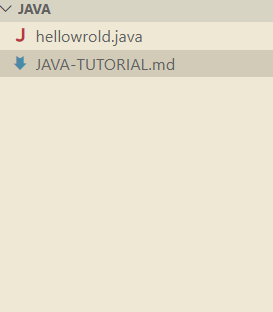

Maintenant, copiez dedans le code du "Hello, World!" :

```Java
public class HelloWorld {
    public static void main(String[] args) {
        System.out.println("Hello, World!");
    }
}
```

Et observez la zone de gauche : 

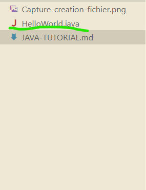

Le fichier a changé de nom tout seul et pris celui de la classe que vous avez créée ! Regardez, on passe en CamelCase ! Mais pour ça, il faut remercier les extensions pour Java que propose VSCode quand on utilise le langage pour la première fois : il semble que les extensions installées pour VSCode adaptent automatiquement le nom du fichier en fonction de la classe principale qu'il contient. Si ces extensions ne sont pas installées, et que le nom du fichier n'est pas celui de la classe qu'il contient, la commande `javac nomDuFichier.java` ne fonctionnerait pas non plus. Encore une fois, ce sont les extensions qui nous retirent une épine du pied, selon toute vraisemblance.

Mais maintenant, si vous entrez dans votre console "java HelloWorld" (voyez la similarité avec un "node fichier.js", commande qui nous permettait de lancer des fichiers sous Node.JS !), vous allez avoir ce message d'erreur :

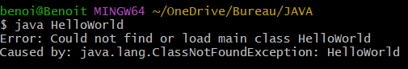

Ou de manière textuelle :

"$ java HelloWorld
Error: Could not find or load main class HelloWorld
Caused by: java.lang.ClassNotFoundException: HelloWorld"

Il manque en fait une étape : le passage au Bytecode, avec la **compilation** ! Et pour compiler, vous devez indiquer dans la console :

*javac HelloWorld.java*, ce qui va créer dans la zone de gauche le fichier "intermédiaire" *HelloWorld.class* qui es ten réalité du bytecode, le langage intermédiare entre le Java et le binaire et qui lui sera lu dans la Java Virtual Machine pour petre éxécuté. Ici, vous pouvez le voir au dessus de HelloWorld.java :

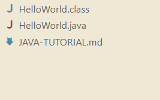

Maintenant seulement vous pouvez entrer "java HelloWorld" dans la console et afficher le résultat !

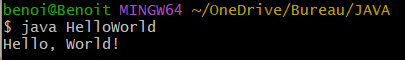

Et en textuel, nous avons ceci :

benoi@Benoit MINGW64 ~/OneDrive/Bureau/Java
$ java HelloWorld
Hello, World!

Vous voyez, comapré à JavaScript, nous avons une étape intermédiaire pour exécuter le programme, la *compilation* qui va traduire votre fichier ;java dans un fichier qui sera interprétable par la machine !

D'ailleurs, si vous voulez voir à quoi peut ressembler du Bytecode, ouvrez HelloWorld.class avec le Bloc Note, et observez :

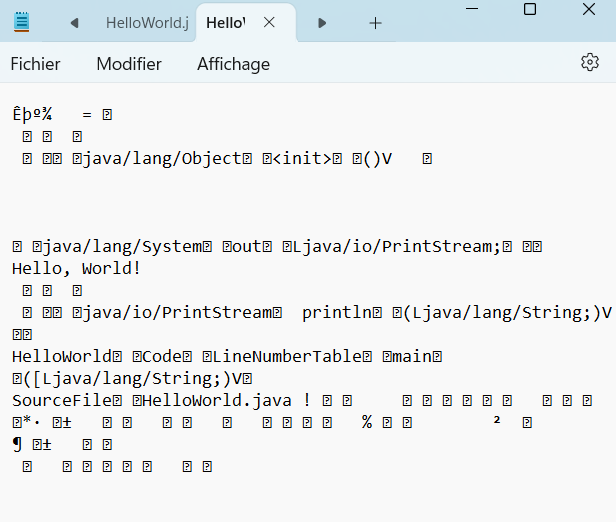

Je pense qu'on est bien d'accord, ce n'est pas "lisible" par un être humain, même vétéran dans le développement ! Tout au plus peut-on reconnaitre des expression dans un nuage de caractères incompréhensibles.

Dernière remarque : avec la commande Run Code, une fois que vous avez compilé un fichier pour la première fois, tous vos fichiers ultérieurs seront automatiquement compilés et exécutés, ce qui simplifie le processus. Avec les bonnes extensions installées dans VS Code, l'étape intermédiaire de compilation devient automatique. Cependant, il est pédagogique de comprendre et d'effectuer manuellement la compilation au début, pour se rappeler que Java ne se contente pas d'exécuter directement les fichiers source.

Et voilà, nous avons vu comment se présente Java dans les grandes lignes, et les différentes étapes pour lancer un fichier !
